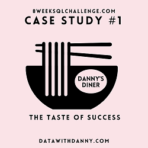

## Contents:
- [Introduction](#introduction)
- [Problem Statement](#problem-statement) 
- [Entity Relationship Diagram](#entity-relationship-diagram)
- [Case Study Questions & Solutions](#case-study-questions--solutions)
- [Bonus Questions & Solutions](#bonus-questions--solutions)
  
## Introduction
Danny is a big fan of Japanese cuisine, and at the start of 2021, he took a bold step by opening a small, charming restaurant specializing in his three favorite dishes: sushi, curry, and ramen.

Now, Danny’s Diner needs your help to keep the business thriving. The restaurant has collected some basic data from its first months of operation but lacks the expertise to analyze and utilize this information effectively for better decision-making. 

## Problem Statement
Danny wants to analyze his customer data to understand their visiting habits, spending patterns, and favorite menu items. These insights will help him improve customer experience and decide whether to expand the loyalty program.

He also needs simple, pre-generated datasets for his team to inspect without using SQL. Due to privacy concerns, Danny has provided a sample of customer data, which includes three key datasets:

- sales
- menu
- members
## Entity Relationship Diagram
<details>
  <summary><strong>show database schema</strong></summary>

```SQL
CREATE SCHEMA dannys_diner;
SET search_path = dannys_diner;

CREATE TABLE sales (
  "customer_id" VARCHAR(1),
  "order_date" DATE,
  "product_id" INTEGER
);

INSERT INTO sales
  ("customer_id", "order_date", "product_id")
VALUES
  ('A', '2021-01-01', '1'),
  ('A', '2021-01-01', '2'),
  ('A', '2021-01-07', '2'),
  ('A', '2021-01-10', '3'),
  ('A', '2021-01-11', '3'),
  ('A', '2021-01-11', '3'),
  ('B', '2021-01-01', '2'),
  ('B', '2021-01-02', '2'),
  ('B', '2021-01-04', '1'),
  ('B', '2021-01-11', '1'),
  ('B', '2021-01-16', '3'),
  ('B', '2021-02-01', '3'),
  ('C', '2021-01-01', '3'),
  ('C', '2021-01-01', '3'),
  ('C', '2021-01-07', '3');

CREATE TABLE menu (
  "product_id" INTEGER,
  "product_name" VARCHAR(5),
  "price" INTEGER
);

INSERT INTO menu
  ("product_id", "product_name", "price")
VALUES
  ('1', 'sushi', '10'),
  ('2', 'curry', '15'),
  ('3', 'ramen', '12');

CREATE TABLE members (
  "customer_id" VARCHAR(1),
  "join_date" DATE
);

INSERT INTO members
  ("customer_id", "join_date")
VALUES
  ('A', '2021-01-07'),
  ('B', '2021-01-09');
```
</details>


## Case Study Questions & Solutions
### 1. What is the total amount each customer spent at the restaurant?

***query:***
```SQL
SELECT s.customer_id, SUM(m.price) AS total_spent
FROM sales s
JOIN menu m ON s.product_id = m.product_id
GROUP BY s.customer_id
ORDER BY total_spent DESC;
```
<details>
  <summary><em><strong>show description</strong></em></summary>
  <p>The SQL query retrieves the `customer_id` and calculates the `total amount spent` (total_spent) by each customer at the restaurant.</p>
  <ul>
    <li>It joins the sales table (s) and the menu table (m) using the `product_id` column, which serves as a common key between the two tables.</li>
    <li>The query then groups the results by `customer_id`, aggregating the `total price` (SUM(m.price)) for each customer.</li>
    <li>The SUM() function calculates the total amount spent by each customer across all their purchases.</li>
    <li>Finally, the results are sorted in descending order (DESC) based on the total_spent value, so customers who spent the most appear at the top.</li>
  </ul>
</details>

***answer:***
| customer_id | total_spent |
| ----------- | ----------- |
| A           | 76          |
| B           | 74          |
| C           | 36          |

### 2. How many days has each customer visited the restaurant?

***query:***
```SQL
SELECT customer_id, COUNT(DISTINCT order_date) AS visits_amount
FROM sales
GROUP BY customer_id
ORDER BY visits_amount ASC;
```

<details>
  <summary><em><strong>show description</strong></em></summary>
  <p>The SQL query retrieves the `customer_id` and calculates the total number of unique visit dates (visits_amount) for each customer at the restaurant.</p>
  <ul>
    <li>It uses the `COUNT(DISTINCT order_date)` function to count the number of unique dates each customer visited the restaurant, ensuring duplicate dates are not counted.</li>
    <li>The query groups the results by customer_id, so the count of unique dates is calculated for each individual customer.</li>
    <li>The results are then sorted in ascending order (ASC) based on `visits_amount`, so customers with the fewest visits appear first.</li>
  </ul>
</details>

***answer:***
| customer_id | visits_amount |
| ----------- | ------------- |
| C           | 2             |
| A           | 4             |
| B           | 6             |

### 3. What was the first item from the menu purchased by each customer?

***query:***
```SQL
WITH first_purchases AS (
  SELECT 
    customer_id,
    MIN(order_date) AS first_order_date
  FROM sales
  GROUP BY customer_id
)
SELECT 
  fp.customer_id,
  m.product_name
FROM first_purchases fp
JOIN sales s 
  ON fp.customer_id = s.customer_id 
  AND fp.first_order_date = s.order_date
JOIN menu m 
  ON s.product_id = m.product_id
ORDER BY fp.customer_id;
```

<details>
  <summary><em><strong>show description</strong></em></summary>
  <p>The SQL query retrieves the `customer_id` and identifies the first menu item (product_name) purchased by each customer based on their earliest order date.</p>
  <ui>
    <li>It uses a Common Table Expression (CTE) named `first_purchases` to calculate the first order date (first_order_date) for each customer.</li>
    <li>Within the CTE, the `MIN(order_date)` function is applied to find the earliest purchase date for each customer_id, and the results are grouped by customer to ensure accuracy.</li>
    <li>The main query joins the result of the CTE (first_purchases) with the `sales` table on both `customer_id` and `order_date` to retrieve all rows corresponding to the first purchase date for each customer.</li>
    <li>It then joins the sales table with the menu table on `product_id` to extract the product name (product_name) of the items purchased on that date.</li>
    <li>The final result is sorted by `customer_id` to provide an organized output.</li>
  </ui>
  <p>This query focuses on identifying items purchased on the first recorded date for each customer. It assumes that all purchases on the same date are part of a single order and doesn't account for the sequence of purchases within the day, as the dataset lacks time information.</p>
  <p>While the `DENSE_RANK()` function could also be used to identify the first purchase, this approach was chosen for its simplicity and clarity, given the dataset's structure.</p>
</details>

***answer:***
| customer_id | product_name |
| ----------- | ------------ |
| A           | sushi        |
| A           | curry        |
| B           | curry        |
| C           | ramen        |
| C           | ramen        |

### 4. What is the most purchased item on the menu and how many times was it purchased by all customers?

***query:***
```SQL
WITH product_counts AS (
  SELECT 
    m.product_name, 
    COUNT(*) AS total_purchases
  FROM sales s
  JOIN menu m
    ON m.product_id = s.product_id
  GROUP BY m.product_name
)
SELECT 
  product_name as most_popular, 
  total_purchases
FROM product_counts
WHERE total_purchases = (SELECT MAX(total_purchases) FROM product_counts);
```
<details>
  <summary><em><strong>show description</strong></em></summary>
  <p>The SQL query retrieves the most popular menu item(s) based on the total number of purchases (total_purchases).</p>
  <ui>
    <li>It uses a Common Table Expression (CTE) named `product_counts` to calculate the total number of purchases for each product. The `COUNT(*)` function counts all purchases, while the results are grouped by product_name using the GROUP BY clause.</li>
    <li>The sales table is joined with the menu table on `product_id` to link sales records with their corresponding product names.</li>
    <li>The main query selects the `product_name` (renamed as most_popular) and `total_purchases` from the CTE.</li>
    <li>It includes a subquery to find the maximum value of total_purchases using the MAX() function. Only products with a purchase count equal to this maximum value are returned.</li>
    <li>This ensures that all products with the highest number of purchases are included, even if multiple products share the same maximum value.</li>
  </ui>
</details>

***answer:***
| most_popular | total_purchases |
| ------------ | --------------- |
| ramen        | 8               |

### 5. Which item was the most popular for each customer?

***query:***
```SQL
WITH sold_per_customer AS (
  SELECT
    customer_id,
    product_id,
    COUNT(product_id) AS items_sold,
    DENSE_RANK() OVER(PARTITION BY customer_id ORDER BY COUNT(product_id) DESC) AS rank_value
  FROM sales
  GROUP BY customer_id, product_id
)
SELECT customer_id, m.product_name, sold_per_customer.items_sold
FROM sold_per_customer
JOIN menu m ON sold_per_customer.product_id = m.product_id
WHERE rank_value = 1
ORDER BY customer_id;
```
<details>
  <summary><em><strong>show description</strong></em></summary>
  <p>The SQL query uses a Common Table Expression (CTE) named `sold_per_customer` to generate a temporary result set that calculates the popularity of items purchased by each customer.</p>
  <ui>
    <li>Within the CTE, it selects the `customer_id`, `product_id`, and calculates the number of times each product was purchased by the customer (items_sold) using the `COUNT(product_id)` function.</li>
    <li>The results are grouped by `customer_id` and `product_id` using the GROUP BY clause, ensuring that the purchase count is calculated for each product of every customer.</li>
    <li>The `DENSE_RANK()` function assigns a rank to each row within the partition of each `customer_id`, ordered by the purchase count (items_sold) in descending order. The most popular product(s) for each customer receive a rank of 1.</li>
    <li>Next, the main query retrieves the `customer_id`, the `purchase count` (items_sold), and the product name (product_name) by joining the CTE with the menu table on the product_id field. It filters the results to include only the rows where the rank (rank_value) is equal to 1, which corresponds to the most purchased product(s) for each customer.</li>
    <li>Finally, the results are sorted by customer_id, returning each customer's ID, their most popular product, and the number of times it was purchased. This query accounts for cases where multiple products are tied as the most popular for a single customer by including all such products in the result.</li>
  </ui>
  <p>The JOIN between the sold_per_customer CTE and the menu table is performed in the main query rather than inside the CTE. This approach ensures that the grouping, ranking, and filtering are applied to a smaller subset of data (only the sales table), which can improve performance when the menu table is large. By deferring the JOIN to the main query, the data processing is streamlined, focusing on only the necessary rows with rank_value = 1.</p>
</details>

***answer:***
| customer_id | product_name | items_sold |
| ----------- | ------------ | ---------- |
| A           | ramen        | 3          |
| B           | sushi        | 2          |
| B           | curry        | 2          |
| B           | ramen        | 2          |
| C           | ramen        | 3          |

### 6. Which item was purchased first by the customer after they became a member?

***query:***
```SQL
WITH first_purchase_date AS (
  SELECT
    s.customer_id,
    MIN(s.order_date) AS first_order_date
  FROM sales s
  JOIN members mmbr ON s.customer_id = mmbr.customer_id
  WHERE s.order_date >= mmbr.join_date
  GROUP BY s.customer_id
)
SELECT
    s.customer_id,
    m.product_name,
    s.order_date
FROM sales s
JOIN first_purchase_date fpd ON s.customer_id = fpd.customer_id AND s.order_date = fpd.first_order_date
JOIN menu m ON s.product_id = m.product_id
ORDER BY s.customer_id, s.order_date;
```
<details>
  <summary><em><strong>show description</strong></em></summary>
  <p>The SQL query retrieves the first product purchased by each customer after they joined the loyalty program.</p>
  <ui>
    <li>It uses a Common Table Expression (CTE) named `first_purchase_date` to calculate the first available order date (`first_order_date`) for each customer after their membership date.</li>
    <li>Within the CTE, the `MIN(s.order_date)` function is used to identify the earliest order date for each customer, and the results are grouped by `customer_id` to ensure the calculation is accurate for each individual.</li>
    <li>The main query joins the `sales` table with the CTE on `customer_id` and `first_order_date`, selecting only the orders that match the earliest date for each customer.</li>
    <li>The query also joins the `sales` table with the `menu` table on `product_id`, enabling the retrieval of the product name (`product_name`) for the identified orders.</li>
    <li>The `WHERE` clause in the CTE filters the results to include only orders made on or after the customer's `join_date`, ensuring that purchases prior to membership are excluded.</li>
    <li>The `ORDER BY s.customer_id, s.order_date` clause ensures the results are sorted by customer and by the date of the order for clear organization.</li>
  </ui>
</details>

***answer:***
| customer_id | product_name | order_date |
| ----------- | ------------ | ---------- |
| A           | curry        | 2021-01-07 |
| B           | sushi        | 2021-01-11 |

### 7. Which item was purchased just before the customer became a member?

***query:***
```SQL
WITH last_purchase_before_membership AS (
  SELECT
    s.customer_id,
    MAX(s.order_date) AS last_order_date
  FROM sales s
  JOIN members mmbr ON s.customer_id = mmbr.customer_id
  WHERE s.order_date < mmbr.join_date
  GROUP BY s.customer_id
)
SELECT
    s.customer_id,
    m.product_name,
    s.order_date
FROM sales s
JOIN last_purchase_before_membership lpbm ON s.customer_id = lpbm.customer_id AND s.order_date = lpbm.last_order_date
JOIN menu m ON s.product_id = m.product_id
ORDER BY s.customer_id, s.order_date;
```
<details>
  <summary><em><strong>show description</strong></em></summary>
  <p>The SQL query retrieves the last product purchased by each customer before they joined the loyalty program.</p>
  <ui>
    <li>It uses a Common Table Expression (CTE) named `last_purchase_before_membership` to calculate the last available order date (`last_order_date`) for each customer before their membership date.</li>
    <li>Within the CTE, the `MAX(s.order_date)` function is used to identify the most recent order date for each customer before their membership, and the results are grouped by `customer_id` to ensure the calculation is specific to each individual.</li>
    <li>The main query joins the `sales` table with the CTE on `customer_id` and `last_order_date`, selecting only the orders that match the last date for each customer.</li>
    <li>The query also joins the `sales` table with the `menu` table on `product_id`, enabling the retrieval of the product name (`product_name`) for the identified orders.</li>
    <li>The `WHERE` clause in the CTE filters the results to include only orders made before the customer's `join_date`, ensuring that purchases on or after membership are excluded.</li>
    <li>The `ORDER BY s.customer_id, s.order_date` clause ensures the results are sorted by customer and by the date of the order for clear organization.</li>
  </ui>
</details>

***answer:***
| customer_id | product_name | order_date |
| ----------- | ------------ | ---------- |
| A           | sushi        | 2021-01-01 |
| A           | curry        | 2021-01-01 |
| B           | sushi        | 2021-01-04 |

### 8. What is the total items and amount spent for each member before they became a member?

***query:***
```SQL
SELECT
    s.customer_id,
    COUNT(s.product_id) AS total_items,
    SUM(m.price) AS total_amount
FROM sales s
JOIN members mmbr ON s.customer_id = mmbr.customer_id
JOIN menu m ON s.product_id = m.product_id
WHERE s.order_date < mmbr.join_date
GROUP BY s.customer_id
ORDER BY s.customer_id;
```
<details>
  <summary><em><strong>show description</strong></em></summary>
  <p>The SQL query retrieves the `customer_id` along with the total count of items ordered (`total_items`) and the total amount spent (`total_amount`) by each customer before they became a member.</p>
  <ui>
    <li>It retrieves data from the `sales` table and joins it with the `menu` table based on matching `product_id`.</li>
    <li>It also joins the `sales` table with the `members` table based on matching `customer_id`.</li>
    <li>The results are filtered based on the condition that the `order_date` in the `sales` table is less than the `join_date` of the customer in the `members` table.</li>
    <li>The `COUNT(s.product_id)` function calculates the number of occurrences of each `product_id` in the `sales` table, giving the total number of items ordered by each customer.</li>
    <li>The `SUM(m.price)` function calculates the sum of the price from the `menu` table, providing the total amount spent by each customer.</li>
    <li>Results are grouped by `customer_id` to get the totals for each customer.</li>
    <li>The query then presents the `customer_id`, `total_items`, and `total_amount` for each customer who placed orders before joining as a member.</li>
    <li>Finally, the results are sorted in ascending order based on the `customer_id`.</li>
  </ui>
</details>

***answer:***
| customer_id | total_items | total_amount |
| ----------- | ----------- | ------------ |
| A           | 2           | 25           |
| B           | 3           | 40           |

### 9. If each $1 spent equates to 10 points and sushi has a 2x points multiplier - how many points would each customer have?

***query:***
```SQL
SELECT
    s.customer_id,
    SUM(
        CASE
            WHEN m.product_name = 'sushi' THEN m.price * 20
            ELSE m.price * 10
        END
    ) AS total_points
FROM sales s
JOIN menu m ON s.product_id = m.product_id
GROUP BY s.customer_id
ORDER BY s.customer_id;
```
<details>
  <summary><em><strong>show description</strong></em></summary>
  <p>The SQL query calculates the total loyalty points earned by each customer based on their purchases, with a 2x multiplier applied for sushi.</p>
  <ui>
    <li>It retrieves data from the `sales` table and joins it with the `menu` table based on matching `product_id`.</li>
    <li>The `CASE` statement is used to apply the points calculation:</li>
      <ui>
        <li>For products with `product_name` equal to `'sushi'`, the points are calculated as `m.price * 20` (since $1 spent equals 10 points, and sushi has a 2x multiplier).</li>
        <li>For all other products, the points are calculated as `m.price * 10`.</li>
      </ui>
    <li>The `SUM()` function aggregates the total points earned across all purchases for each customer.</li>
    <li>The query groups the results by `customer_id` to calculate the total points for each customer individually.</li>
    <li>The results are ordered by `customer_id` in ascending order to provide a clear, organized output.</li>
  </ui>
</details>

***answer:***
| customer_id | total_points |
| ----------- | ------------ |
| A           | 860          |
| B           | 940          |
| C           | 360          |

### 10. In the first week after a customer joins the program (including their join date) they earn 2x points on all items, not just sushi - how many points do customer A and B have at the end of January?

***query:***
```SQL
SELECT
    s.customer_id,
    SUM(
        CASE
            WHEN s.order_date BETWEEN mmbr.join_date AND mmbr.join_date + INTERVAL '6 days'
                 THEN m.price * 20
            ELSE m.price * 10
        END
    ) AS total_points
FROM sales s
JOIN members mmbr ON s.customer_id = mmbr.customer_id
JOIN menu m ON s.product_id = m.product_id
WHERE s.order_date <= '2021-01-31'
GROUP BY s.customer_id
ORDER BY s.customer_id;
```
<details>
  <summary><em><strong>show description</strong></em></summary>
  <p>The SQL query calculates the total loyalty points earned by each customer by the end of January 2021, with a 2x multiplier applied to all items purchased during the first week after joining the loyalty program.</p>
  <ui>
    <li>It retrieves data from the `sales` table and joins it with the `menu` table on matching `product_id` to fetch product prices.</li>
    <li>It also joins the `sales` table with the `members` table on matching `customer_id` to determine the `join_date` for each customer.</li>
    <li>The `CASE` statement is used to apply the points calculation:</li>
    <ui>
      <li>For purchases made between `join_date` and `join_date + INTERVAL '6 days'` (the first week of membership), points are calculated as `m.price * 20` (2x multiplier for all items).</li>
      <li>For all other purchases, points are calculated as `m.price * 10`.</li>
    </ui>
    <li>The `WHERE` clause filters the results to include only orders made on or before `'2021-01-31'`, ensuring that only January purchases are considered.</li>
    <li>The `SUM()` function aggregates the total points earned across all purchases for each customer.</li>
    <li>The query groups the results by `customer_id` to calculate the total points for each customer individually.</li>
    <li>The results are sorted by `customer_id` in ascending order to provide a clear, organized output.</li>
  </ui>
</details>

***answer:***
| customer_id | total_points |
| ----------- | ------------ |
| A           | 1270         |
| B           | 720          |


## Bonus Questions & Solutions

### 1. Join All The Things

***query:***
```SQL
SELECT
    s.customer_id,
    s.order_date,
    m.product_name,
    m.price,
    CASE
      WHEN s.order_date >= mmbr.join_date THEN 'Y'
        ELSE 'N'
      END AS member
FROM sales s
JOIN menu m ON s.product_id = m.product_id
LEFT JOIN members mmbr ON s.customer_id = mmbr.customer_id
ORDER BY s.customer_id, s.order_date, m.product_name;
```
<details>
  <summary><em><strong>show description</strong></em></summary>
  <p>The SQL query recreates the requested table output by combining information from the `sales`, `menu`, and `members` tables.</p>
  <ui>
    <li>It retrieves data from the `sales` table and joins it with the `menu` table on matching `product_id` to include the product name (`product_name`) and price (`price`) for each order.</li>
    <li>A `LEFT JOIN` is used to connect the `sales` table with the `members` table on `customer_id`, allowing access to the `join_date` for each customer while including non-member customers.</li>
    <li>A `CASE` statement is used to determine the membership status (`member`) for each order:</li>
    <ui>
        <li>Returns `'Y'` if the `order_date` is greater than or equal to the `join_date`.</li>
        <li>Returns `'N'` if the `order_date` is before the `join_date` or the customer is not a member.</li>
    </ui>
    <li>The query results are ordered by `customer_id`, `order_date`, and `product_name` to match the desired output structure.</li>
  </ui>
</details>

***answer:***
| customer_id | order_date | product_name | price | member |
| ----------- | ---------- | ------------ | ----- | ------ |
| A           | 2021-01-01 | curry        | 15    | N      |
| A           | 2021-01-01 | sushi        | 10    | N      |
| A           | 2021-01-07 | curry        | 15    | Y      |
| A           | 2021-01-10 | ramen        | 12    | Y      |
| A           | 2021-01-11 | ramen        | 12    | Y      |
| A           | 2021-01-11 | ramen        | 12    | Y      |
| B           | 2021-01-01 | curry        | 15    | N      |
| B           | 2021-01-02 | curry        | 15    | N      |
| B           | 2021-01-04 | sushi        | 10    | N      |
| B           | 2021-01-11 | sushi        | 10    | Y      |
| B           | 2021-01-16 | ramen        | 12    | Y      |
| B           | 2021-02-01 | ramen        | 12    | Y      |
| C           | 2021-01-01 | ramen        | 12    | N      |
| C           | 2021-01-01 | ramen        | 12    | N      |
| C           | 2021-01-07 | ramen        | 12    | N      |

### 2. Rank All The Things

***query:***
```SQL
SELECT
    s.customer_id,
    s.order_date,
    m.product_name,
    m.price,
    CASE
        WHEN s.order_date >= mmbr.join_date THEN 'Y'
        ELSE 'N'
    END AS member,
    CASE
        WHEN s.order_date >= mmbr.join_date THEN RANK() OVER (
            PARTITION BY s.customer_id
            ORDER BY s.order_date
        )
        ELSE NULL
    END AS ranking
FROM sales s
JOIN menu m ON s.product_id = m.product_id
LEFT JOIN members mmbr ON s.customer_id = mmbr.customer_id
ORDER BY s.customer_id, s.order_date, m.product_name;
```
<details>
  <summary><em><strong>show description</strong></em></summary>
  <p>The SQL query calculates the ranking of products purchased by customers, but only for purchases made after they joined the loyalty program, leaving non-member purchases unranked (`NULL`).</p>
  <ui>
    <li>It retrieves data from the `sales` table and joins it with the `menu` table on matching `product_id` to include `product_name` and `price`.</li>
    <li>A `LEFT JOIN` is used to connect the `sales` table with the `members` table on `customer_id`, enabling access to the `join_date` for each customer.</li>
    <li>A `CASE` statement determines the membership status (`member`):</li>
    <ui>
        <li>Returns `'Y'` if the `order_date` is greater than or equal to the `join_date`.</li>
        <li>Returns `'N'` otherwise.</li>
    </ui>
    <li>Another `CASE` statement applies the ranking logic:</li>
        <ui>
        <li>If the `order_date` is on or after the `join_date`, the `RANK()` function is applied, partitioning by `customer_id` and ordering by `order_date` to assign sequential ranks for purchases.</li>
        <li>If the `order_date` is before the `join_date`, the ranking is set to `NULL`.</li>
    </ui>
    <li>The query groups the results by `customer_id` and `order_date`, while the `ORDER BY` clause sorts the output by `customer_id`, `order_date`, and `product_name` for clear organization.</li>
  </ui>
</details>

***answer:***
| customer_id | order_date | product_name | price | member | ranking |
| ----------- | ---------- | ------------ | ----- | ------ | ------- |
| A           | 2021-01-01 | curry        | 15    | N      | null    |
| A           | 2021-01-01 | sushi        | 10    | N      | null    |
| A           | 2021-01-07 | curry        | 15    | Y      | 3       |
| A           | 2021-01-10 | ramen        | 12    | Y      | 4       |
| A           | 2021-01-11 | ramen        | 12    | Y      | 5       |
| A           | 2021-01-11 | ramen        | 12    | Y      | 5       |
| B           | 2021-01-01 | curry        | 15    | N      | null    |
| B           | 2021-01-02 | curry        | 15    | N      | null    |
| B           | 2021-01-04 | sushi        | 10    | N      | null    |
| B           | 2021-01-11 | sushi        | 10    | Y      | 4       |
| B           | 2021-01-16 | ramen        | 12    | Y      | 5       |
| B           | 2021-02-01 | ramen        | 12    | Y      | 6       |
| C           | 2021-01-01 | ramen        | 12    | N      | null    |
| C           | 2021-01-01 | ramen        | 12    | N      | null    |
| C           | 2021-01-07 | ramen        | 12    | N      | null    |
