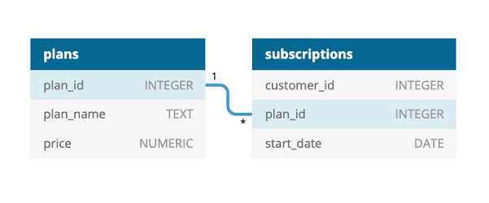

## Contents:
- [Introduction](#introduction)
- [Entity Relationship Diagram](#entity-relationship-diagram)
- [Case Study Questions & Solutions](#case-study-questions--solutions)
  - [A. Customer Journey](#a-customer-journey)
  - [B. Data Analysis Questions](#b-data-analysis-questions)
  - [C. Challenge Payment Question](#c-challenge-payment-question)
  - [D. Outside The Box Questions](#d-outside-the-box-questions)
- [Analysis of Foodie-Fi's 2020 Performance](#analysis-of-foodie-fis-2020-performance)

## Introduction
> Subscription based businesses are super popular and Danny realised that there was a large gap in the market - he wanted to create a new streaming service that only had food related content - something like Netflix but with only cooking shows!
>
>Danny finds a few smart friends to launch his new startup Foodie-Fi in 2020 and started selling monthly and annual subscriptions, giving their customers unlimited on-demand access to exclusive food videos from around the world!
>
>Danny created Foodie-Fi with a data driven mindset and wanted to ensure all future investment decisions and new features were decided using data. This case study focuses on using subscription style digital data to answer important business questions.

## Entity Relationship Diagram
<details>
  <summary><em>show database schema<b>*</b></em></summary>

```SQL
CREATE SCHEMA foodie_fi;
SET search_path = foodie_fi;

CREATE TABLE plans (
  plan_id INTEGER,
  plan_name VARCHAR(13),
  price DECIMAL(5,2)
);

INSERT INTO plans
  (plan_id, plan_name, price)
VALUES
  ('0', 'trial', '0'),
  ('1', 'basic monthly', '9.90'),
  ('2', 'pro monthly', '19.90'),
  ('3', 'pro annual', '199'),
  ('4', 'churn', null);


CREATE TABLE subscriptions (
  customer_id INTEGER,
  plan_id INTEGER,
  start_date DATE
);

INSERT INTO subscriptions
  (customer_id, plan_id, start_date)
VALUES
  ('1', '0', '2020-08-01'),
  ('1', '1', '2020-08-08'),
  ('2', '0', '2020-09-20'),
  ('2', '3', '2020-09-27'),
  ('3', '0', '2020-01-13'),
  ('3', '1', '2020-01-20'),
  -- ...
  ('1000', '0', '2020-03-19'),
  ('1000', '2', '2020-03-26'),
  ('1000', '4', '2020-06-04');
```

**\*Note**:
1. Primary keys are not explicitly defined in the tables. This might be intentional due to the educational nature of the project:  
  - The data is artificially generated and static, minimizing the risk of integrity violations.  
  - In real-world scenarios, primary keys are essential to enforce data integrity and uniqueness.  

2. Data type mismatches are present in the inserted values:  
  - For example, string values are being inserted into columns with numeric data types.  
  - PostgreSQL implicitly converts these values, allowing the data to be stored. However, this practice is discouraged in production systems.  
  - Explicit type casting should be used to ensure data consistency and to prevent unexpected errors. 

</details>




## Case Study Questions & Solutions.
## A. Customer Journey.
### 1. Based off the 8 sample customers provided in the sample from the subscriptions table, write a brief description about each customer’s onboarding journey.

***query:***
```SQL
WITH basic_join AS (
  SELECT
    S.customer_id,
    S.start_date,
    P.plan_name,
    P.price
  FROM
    subscriptions S
  JOIN
    plans P USING(plan_id)
  WHERE
    S.customer_id BETWEEN 1 AND 9
),
dated_plans AS (
  SELECT
    customer_id,
    start_date,
    plan_name,
    price,
    LEAD(start_date) OVER (PARTITION BY customer_id ORDER BY start_date) AS next_start_date
  FROM
    basic_join
),
calculated_revenue AS (
  SELECT
    customer_id,
    start_date,
    plan_name,
    price,
    (CASE
       WHEN plan_name = 'churn' THEN 0
       WHEN next_start_date IS NOT NULL THEN next_start_date - start_date
       ELSE DATE '2024-12-31' - start_date
     END) AS plan_duration_days,
    (CASE
       WHEN plan_name = 'trial' THEN 0
       WHEN plan_name = 'churn' THEN 0
       WHEN plan_name = 'pro annual' THEN 
         ROUND(price * FLOOR(
           (CASE
             WHEN next_start_date IS NOT NULL THEN (next_start_date - start_date)
             ELSE (DATE '2024-12-31' - start_date)
           END) / 365.0), 2)
       ELSE ROUND(price * FLOOR(
           (CASE
             WHEN next_start_date IS NOT NULL THEN (next_start_date - start_date)
             ELSE (DATE '2024-12-31' - start_date)
           END) / 30.0), 2)
     END) AS revenue
  FROM dated_plans
)
SELECT
  customer_id,
  start_date,
  plan_name,
  price,
  plan_duration_days,
  revenue
FROM
  calculated_revenue
ORDER BY
  customer_id, start_date;
```

<details>
  <summary><em><strong>show description</strong></em></summary>

This SQL query calculates detailed subscription and revenue data for customers within a specific range of `customer_id`.

- `basic_join` CTE:
  - Joins the `subscriptions` table with the `plans` table to retrieve `plan_name` and `price_usd`.
  - Filters customers with `customer_id` values between 1 and 9.

- `dated_plans` CTE:
  - Calculates the next subscription start date for each customer using the `LEAD` function, partitioned by `customer_id` and ordered by `start_date`.
  - Adds a column `next_start_date` to capture the start of the next plan or `NULL` if it doesn't exist.

- `calculated_revenue` CTE:
  - Adds the column `plan_duration_days`, which calculates the duration of each plan:
    - For plans ending before `2024-12-31`, the duration is the difference between `next_start_date` and `start_date`.
    - For plans without a `next_start_date`, the duration is calculated as the difference between `2024-12-31` and `start_date`.
    - For `churn` plans, the duration is set to `0`.
  - Adds the column `revenue_usd`, which computes the revenue generated from each plan:
    - For `trial` and `churn` plans, the revenue is `0`.
    - For `pro annual` plans, revenue is calculated based on the number of full years (`365 days`) the plan was active.
    - For all other plans, revenue is calculated based on the number of full months (`30 days`) the plan was active.
    - Rounds revenue to two decimal places.

- `Main Query`:
  - Retrieves `customer_id`, `start_date`, `plan_name`, `plan_duration_days`, and `revenue_usd` from the `calculated_revenue` CTE.
  - Orders the results by `customer_id` and `start_date`.

</details>

***answer:***
| customer_id | plan_name     | start_date | plan_duration_days | revenue_usd |
| ----------- | ------------- | ---------- | ------------------ | ----------- |
| 1           | trial         | 2020-08-01 | 7                  | 0           |
| 1           | basic monthly | 2020-08-08 | 1606               | 524.70      |
| 2           | trial         | 2020-09-20 | 7                  | 0           |
| 2           | pro annual    | 2020-09-27 | 1556               | 796.00      |
| 3           | trial         | 2020-01-13 | 7                  | 0           |
| 3           | basic monthly | 2020-01-20 | 1807               | 594.00      |
| 4           | trial         | 2020-01-17 | 7                  | 0           |
| 4           | basic monthly | 2020-01-24 | 88                 | 19.80       |
| 4           | churn         | 2020-04-21 | 0                  | 0           |
| 5           | trial         | 2020-08-03 | 7                  | 0           |
| 5           | basic monthly | 2020-08-10 | 1604               | 524.70      |
| 6           | trial         | 2020-12-23 | 7                  | 0           |
| 6           | basic monthly | 2020-12-30 | 58                 | 9.90        |
| 6           | churn         | 2021-02-26 | 0                  | 0           |
| 7           | trial         | 2020-02-05 | 7                  | 0           |
| 7           | basic monthly | 2020-02-12 | 100                | 29.70       |
| 7           | pro monthly   | 2020-05-22 | 1684               | 1114.40     |
| 8           | trial         | 2020-06-11 | 7                  | 0           |
| 8           | basic monthly | 2020-06-18 | 46                 | 9.90        |
| 8           | pro monthly   | 2020-08-03 | 1611               | 1054.70     |
| 9           | trial         | 2020-12-07 | 7                  | 0           |
| 9           | pro annual    | 2020-12-14 | 1478               | 796.00      |

<details>
  <summary><em><strong>show customer onboarding analysis</strong></em></summary>

**To ensure consistent results, a fixed date of `2024-12-31` was used to represent the current status of active customers. This prevents output changes over time

Customer 1: Started with a 7-day trial, then switched to the basic monthly plan. The customer has been active for 1606 days, generating 524.70 USD in revenue.

Customer 2: Began with a 7-day trial and chose the pro annual plan. The customer has been active for 1556 days, contributing 796.00 USD in revenue.

Customer 3: After the trial period, subscribed to the basic monthly plan and has been active for 1807 days, resulting in 594.00 USD in revenue.

Customer 4: Transitioned to basic monthly after the trial but churned after 88 days. Total revenue generated: 19.80 USD.

Customer 5: Started with a trial, followed by the basic monthly plan. The customer has been active for 1604 days, generating 524.70 USD in revenue.

Customer 6: Subscribed to the basic monthly plan after the trial but churned after 58 days. Total revenue: 9.90 USD.

Customer 7: Began with a trial, switched to basic monthly, and later upgraded to pro monthly. The customer has been active for 1784 days, contributing 1114.40 USD in revenue.

Customer 8: Transitioned from a trial to basic monthly and later upgraded to pro monthly. The customer has been active for 1657 days, generating 1054.70 USD in revenue.

Customer 9: Started with a trial and opted for the pro annual plan. The customer has been active for 1485 days, contributing 796.00 USD in revenue.

</details>

---

## B. Data Analysis Questions.
### 1. How many customers has Foodie-Fi ever had?

***query:***
```SQL
SELECT
  COUNT(DISTINCT(customer_id)) AS customers_amount
FROM
  subscriptions;
```

<details>
  <summary><em><strong>show description</strong></em></summary>

This SQL query calculates the total number of unique customers Foodie-Fi has ever had by:

- Using the `DISTINCT` clause on the `customer_id` column to ensure each customer is counted only once.
- Using the `COUNT` function to determine the total number of distinct customers.

This query provides the total customer count, irrespective of their current subscription status.

</details>

***answer:***

| customers_amount |
|------------------|
| 1000             |

### 2. What is the monthly distribution of trial plan start_date values for our dataset - use the start of the month as the group by value?

***query:***
```SQL
SELECT
  DATE_TRUNC('month', start_date)::DATE AS month,
  COUNT(*) AS trials_started
FROM subscriptions
WHERE plan_id = 0
GROUP BY month
ORDER BY month;
```

<details>
  <summary><em><strong>show description</strong></em></summary>

This SQL query calculates the monthly distribution of trial plan `start_date` values using `plan_id` instead of `plan_name` for filtering.

- `FROM Clause`:
  - Uses the `subscriptions` table as the data source.

- `WHERE Clause`:
  - Filters the data to include only rows where `plan_id` equals `0`, corresponding to the `trial` plan.

- `DATE_TRUNC Function`:
  - Truncates the `start_date` to the first day of each month using `DATE_TRUNC('month', start_date)::DATE`, removing the time component.

- `Aggregation`:
  - Uses `COUNT(*)` to calculate the number of rows for each month.

- `GROUP BY Clause`:
  - Groups the results by the truncated `month`.

- `Ordering`:
  - Sorts the grouped results by the `month` in ascending order.

</details>

***answer:***
| month      | trials_started |
| ---------- | -------------- |
| 2020-01-01 | 88             |
| 2020-02-01 | 68             |
| 2020-03-01 | 94             |
| 2020-04-01 | 81             |
| 2020-05-01 | 88             |
| 2020-06-01 | 79             |
| 2020-07-01 | 89             |
| 2020-08-01 | 88             |
| 2020-09-01 | 87             |
| 2020-10-01 | 79             |
| 2020-11-01 | 75             |
| 2020-12-01 | 84             |

---

### 3. What plan start_date values occur after the year 2020 for our dataset? Show the breakdown by count of events for each plan_name?

***query:***
```SQL
SELECT
  plan_name,
  COUNT(*) AS events_count
FROM
  subscriptions
JOIN
  plans USING(plan_id)
WHERE
  start_date > '2020-12-31'
GROUP BY
  plan_name
ORDER BY
  events_count DESC;
```

<details>
  <summary><em><strong>show description</strong></em></summary>

The query calculates the count of `start_date` events after the year 2020 for each `plan_name` in the dataset.

`FROM and JOIN`:
  - The `subscriptions` table is joined with the `plans` table using the `plan_id` key to retrieve plan details.

`WHERE Condition`:
  - Filters rows where the `start_date` is later than `2020-12-31`, ensuring only events from 2021 onward are included.

`GROUP BY`:
  - Groups the results by `plan_name` to calculate the count of events for each distinct plan.

`SELECT`:
  - Retrieves the `plan_name` and the count of events (`events_count`) for each plan.

`ORDER BY`:
  - Sorts the results in descending order of `events_count` to show plans with the highest counts first.

</details>

***answer:***
| plan_name     | events_count |
| ------------- | ------------ |
| churn         | 71           |
| pro annual    | 63           |
| pro monthly   | 60           |
| basic monthly | 8            |

---

### 4. What is the customer count and percentage of customers who have churned rounded to 1 decimal place?

***query:***
```SQL
WITH total_customers AS (
  SELECT
    COUNT(DISTINCT customer_id) AS total_count
  FROM
    subscriptions
),
churned_customers AS (
  SELECT
    COUNT(DISTINCT customer_id) AS churned_count
  FROM
    subscriptions
  WHERE
    plan_id = 4
)

SELECT 
  churned_customers.churned_count,
  ROUND((churned_customers.churned_count::DECIMAL / total_customers.total_count) * 100, 1) AS churn_percentage
FROM 
  churned_customers, total_customers;
```

<details>
  <summary><em><strong>show description</strong></em></summary>

This SQL query calculates the count and percentage of customers who have churned, rounded to 1 decimal place.

`total_customers` CTE:
  - Computes the total number of distinct customers in the `subscriptions` table.
  - Uses `COUNT(DISTINCT customer_id)` to ensure unique customer counts.

`churned_customers` CTE:
  - Computes the total number of distinct customers who have churned.
  - Filters the `subscriptions` table to include only rows where `plan_id = 4` (indicating churn).

Main Query:
  - Selects `churned_count` from `churned_customers` and calculates the churn percentage:
    - Divides the churned customer count by the total customer count from the respective CTEs.
    - Multiplies by 100 to get the percentage.
    - Uses `ROUND(..., 1)` to round the result to 1 decimal place.

`FROM` Clause:
  - Combines the results of `churned_customers` and `total_customers` CTEs without the need for explicit joins since both CTEs return a single-row result.

This approach ensures readability and logical separation of the calculations.
</details>

***answer:***
| churned_count | churn_percentage |
| ------------- | ---------------- |
| 307           | 30.7             |

---

### 5. How many customers have churned straight after their initial free trial - what percentage is this rounded to the nearest whole number?

***query:***
```SQL
WITH plan_transitions AS (
  SELECT 
    s.customer_id,
    p.plan_name AS current_plan,
    LEAD(p.plan_name) OVER (
      PARTITION BY s.customer_id
      ORDER BY s.start_date
    ) AS next_plan
  FROM
    subscriptions s
  JOIN
    plans p ON s.plan_id = p.plan_id
)
SELECT 
  COUNT(customer_id) AS churned_customers,
  ROUND(100.0 * COUNT(customer_id) / (SELECT COUNT(DISTINCT customer_id) FROM subscriptions), 0) AS churned_percentage
FROM
  plan_transitions
WHERE
  current_plan = 'trial' 
  AND next_plan = 'churn';
```

<details>
  <summary><em><strong>show description</strong></em></summary>

- `trial_to_churn_transitions` CTE:
   - Retrieves each customer's `current_plan` and the `next_plan` using the `LEAD` window function.
   - The `LEAD` function is partitioned by `customer_id` and ordered by `start_date` to identify the immediate next plan following the current one.
   - Includes the following columns:
     - `customer_id`: Unique identifier for each customer.
     - `current_plan`: The current plan the customer is on for the given `start_date`.
     - `next_plan`: The plan the customer transitions to after the current plan.

- Main Query:
   - Filters data from `trial_to_churn_transitions` to include only rows where `current_plan` is `trial` and `next_plan` is `churn`, indicating customers who churned immediately after their free trial.
   - Calculates:
     - `churned_customers`: The count of unique customers who fit the criteria.
     - `churned_percentage`: The percentage of churned customers out of the total number of customers in the dataset.
       - Uses a subquery to determine the total number of distinct customers.
       - Multiplies the ratio of churned customers to total customers by 100 and rounds to the nearest whole number.
   - Returns two columns:
     - `churned_customers`: The total number of customers who churned directly after the trial.
     - `churned_percentage`: The percentage of customers who churned relative to the total customer base.

- Ordering:
   - Not explicitly applied since the output consists of aggregated values.

</details>

***answer:***
| churned_customers | churned_percentage |
| ----------------- | ------------------ |
| 92                | 9                  |

---

### 6. What is the number and percentage of customer plans after their initial free trial?

***query:***
```SQL
WITH plan_transitions AS (
  SELECT 
    S.customer_id, 
    P.plan_name, 
    LEAD(P.plan_name) OVER (
      PARTITION BY S.customer_id 
      ORDER BY S.start_date
     ) AS next_plan
  FROM
    subscriptions S
  JOIN
    plans P USING(plan_id)
)

SELECT
  next_plan AS plan_after_trial, 
  COUNT(customer_id) AS customer_count, 
  ROUND(
    100.0 * COUNT(customer_id) / 
    (SELECT
      COUNT(DISTINCT customer_id)
    FROM
      subscriptions), 1
    ) AS percentage
FROM
  plan_transitions
WHERE
  next_plan IS NOT NULL
  AND plan_name = 'trial'
GROUP BY
  next_plan
ORDER BY
  percentage DESC;
```

<details>
  <summary><em><strong>show description</strong></em></summary>

- `WITH plan_transitions AS (...)`:
  - Creates a Common Table Expression (CTE) `plan_transitions` to calculate transitions between customer plans.
  - Retrieves the `customer_id`, the current plan name (`plan_name`), and the next plan name (`next_plan`).
  - Uses the `LEAD` function to get the next plan name within the same `customer_id`, ordered by the `start_date` of the subscription.
  - Joins the `subscriptions` table (`S`) with the `plans` table (`P`) on the `plan_id` to translate numerical plan IDs into their corresponding names.

- `SELECT next_plan AS plan_after_trial, ... FROM plan_transitions`:
  - Aggregates the results from `plan_transitions` to calculate the distribution of customer plans following a trial period.
  - Filters the data to include only rows where:
    - `next_plan IS NOT NULL`, ensuring there is a subsequent plan after the current one.
    - `plan_name = 'trial'`, focusing specifically on customers transitioning from a trial plan.

- `COUNT(customer_id)`:
  - Counts the number of customers who transitioned from the trial plan to each subsequent plan.

- `ROUND(100.0 * COUNT(customer_id) / ...) AS percentage`:
  - Calculates the percentage of customers transitioning to each subsequent plan relative to the total number of unique customers in the `subscriptions` table.
  - The `COUNT(DISTINCT customer_id)` in the subquery determines the total unique customers.

- `GROUP BY next_plan`:
  - Groups the data by the `next_plan`, which represents the plan each customer transitioned to after the trial.

- `ORDER BY percentage DESC`:
  - Orders the results by the percentage in descending order to show the most popular plans first.

</details>

***answer:***
| plan_after_trial | customer_count | percentage |
| ---------------- | -------------- | ---------- |
| basic monthly    | 546            | 54.6       |
| pro monthly      | 325            | 32.5       |
| churn            | 92             | 9.2        |
| pro annual       | 37             | 3.7        |

---

### 7. What is the customer count and percentage breakdown of all 5 plan_name values at 2020-12-31?

***query:***
```SQL
WITH filtered_subscriptions AS (
  SELECT
    *
  FROM
    subscriptions
  WHERE
    start_date <= '2020-12-31'
)

SELECT
  P.plan_name,
  COUNT(DISTINCT FS.customer_id) AS customers_amount,
  ROUND(
    CAST(COUNT(DISTINCT FS.customer_id) AS DECIMAL) / (
      SELECT COUNT(DISTINCT customer_id)
      FROM filtered_subscriptions
    ) * 100, 2
  ) AS percentage
FROM
  filtered_subscriptions FS
JOIN
  plans P USING(plan_id)
GROUP BY
  P.plan_name
ORDER BY
  percentage DESC;
```

<details>
  <summary><em><strong>show description</strong></em></summary>

- The query begins by defining a Common Table Expression (CTE) named `filtered_subscriptions`. This CTE selects all rows from the `subscriptions` table where the `start_date` is on or before `2020-12-31`.

- The main query calculates the customer count and percentage breakdown for each `plan_name`:
  - It selects data from the CTE `filtered_subscriptions` and joins it with the `plans` table using the `plan_id` field.
  - For each `plan_name`, the query computes:
    - `customers_amount`: The number of unique customers for the specific plan.
    - `percentage`: The percentage of customers for the plan relative to the total number of unique customers across all plans in the `filtered_subscriptions` CTE.
      - A subquery is used to calculate the total count of unique customers in the CTE.
      - The percentage is rounded to two decimal places.

- The results are grouped by `plan_name` to aggregate data for each plan.

- The results are sorted in descending order by `percentage`, ensuring that the most popular plans appear first in the output.

</details>

***answer:***
| plan_name     | customers_amount | percentage |
| ------------- | ---------------- | ---------- |
| trial         | 1000             | 100.00     |
| basic monthly | 538              | 53.80      |
| pro monthly   | 479              | 47.90      |
| churn         | 236              | 23.60      |
| pro annual    | 195              | 19.50      |

---

### 8. How many customers have upgraded to an annual plan in 2020?\*

**\*** The original question aimed to determine how many customers upgraded to an annual plan in 2020. However, this solution extends the analysis to include the previous plans that customers were on before upgrading. This was done out of interest in understanding the customer journey leading to the annual plan transition.

***query:***
```SQL
WITH year_filtered_table AS(
  SELECT
    S.customer_id,
    P.plan_name,
    LAG(P.plan_name) OVER (PARTITION BY S.customer_id ORDER BY S.start_date) AS previous_plan,
    S.start_date
  FROM
    subscriptions S
  JOIN
    plans P USING(plan_id)
  )
SELECT
 previous_plan AS upgraded_from_plan,
 COUNT (*) AS customers_amount
FROM
  year_filtered_table
WHERE 
  plan_name LIKE '%annual%' AND EXTRACT(year FROM start_date) = 2020
GROUP BY
  previous_plan
ORDER BY
  customers_amount DESC;
```

<details>
  <summary><em><strong>show description</strong></em></summary>

- `year_filtered_table`: This Common Table Expression (CTE) retrieves all relevant subscription data, including the `customer_id`, the `plan_name`, and the previous plan (`previous_plan`) for each customer. The previous plan is calculated using the `LAG()` window function, partitioned by `customer_id` and ordered by `start_date`.

- The main query calculates the number of customers (`customers_amount`) grouped by their `previous_plan` before upgrading to an annual plan in 2020. It filters for rows where `plan_name` contains the term "annual" and the `start_date` is in 2020.

- The `COUNT(*)` function is used to count the number of customers for each group. The query then sorts the results in descending order of `customers_amount`, making it easy to see which previous plans contributed most to annual plan upgrades.

</details>

***answer:***
| upgraded_from_plan | customers_amount |
| ------------------ | ---------------- |
| basic monthly      | 88               |
| pro monthly        | 70               |
| trial              | 37               |

---

### 9. How many days on average does it take for a customer to an annual plan from the day they join Foodie-Fi?

***query:***
```SQL
WITH customer_transitions AS (
  SELECT
    S.customer_id,
    MIN(S.start_date) AS join_date, -- Date of joining Foodie-Fi
    MIN(CASE WHEN P.plan_name LIKE '%annual%' THEN S.start_date END) AS annual_plan_date -- First annual plan date
  FROM
    subscriptions S
  JOIN
    plans P USING(plan_id)
  GROUP BY
    S.customer_id
),
days_to_annual_plan AS (
  SELECT
    customer_id,
    annual_plan_date - join_date AS days_to_annual
  FROM
    customer_transitions
  WHERE
    annual_plan_date IS NOT NULL -- Only include customers who upgraded to an annual plan
)
SELECT
  ROUND(AVG(days_to_annual), 0) AS avg_days_to_annual
FROM
  days_to_annual_plan;
```

<details>
  <summary><em><strong>show description</strong></em></summary>

- `customer_transitions`: This Common Table Expression (CTE) identifies two key dates for each customer:
  - `join_date`: The earliest `start_date` recorded in the `subscriptions` table, representing when the customer first joined Foodie-Fi.
  - `annual_plan_date`: The earliest `start_date` associated with an annual plan, filtered by `plan_name` containing "annual."

- `days_to_annual_plan`: This CTE calculates the number of days between `join_date` and `annual_plan_date` for customers who upgraded to an annual plan:
  - It uses the `annual_plan_date` and `join_date` fields to compute the difference in days.
  - Customers without an upgrade to an annual plan are excluded (`WHERE annual_plan_date IS NOT NULL`).

- The final query:
  - Aggregates the number of days taken for all customers to upgrade to an annual plan.
  - Calculates the average using the `AVG` function.
  - The result is rounded to 2 decimal places for clarity using the `ROUND` function.

</details>

***answer:***
| avg_days_to_annual |
| ------------------ |
| 105                |

---

### 10. Can you further breakdown this average value into 30 day periods (i.e. 0-30 days, 31-60 days etc)?

***query:***

```SQL
WITH days_to_annual_plan AS (
  SELECT
    S.customer_id,
    MIN(S.start_date) AS join_date,
    MIN(
      CASE 
        WHEN P.plan_name LIKE '%annual%' THEN S.start_date 
      END
    ) AS annual_plan_date
  FROM
    subscriptions S
  JOIN
    plans P USING(plan_id)
  GROUP BY
    S.customer_id
),
days_difference AS (
  SELECT
    customer_id,
    annual_plan_date - join_date AS days_to_annual
  FROM
    days_to_annual_plan
  WHERE
    annual_plan_date IS NOT NULL
),
time_intervals AS (
  SELECT
    customer_id,
    CASE
      WHEN days_to_annual <= 30 THEN '0-30 days'
      WHEN days_to_annual <= 60 THEN '31-60 days'
      WHEN days_to_annual <= 90 THEN '61-90 days'
      WHEN days_to_annual <= 120 THEN '91-120 days'
      ELSE '120+ days'
    END AS time_period
  FROM
    days_difference
)
SELECT
  time_period,
  COUNT(customer_id) AS customers_count
FROM
  time_intervals
GROUP BY
  time_period
ORDER BY
  CASE
    WHEN time_period = '0-30 days' THEN 1
    WHEN time_period = '31-60 days' THEN 2
    WHEN time_period = '61-90 days' THEN 3
    WHEN time_period = '91-120 days' THEN 4
    ELSE 5
  END;
```

<details>
  <summary><em><strong>show description</strong></em></summary>
  
- `days_to_annual_plan`:
  - This Common Table Expression (CTE) retrieves the initial subscription (`join_date`) and the first date the customer upgrades to an annual plan (`annual_plan_date`) for each customer.
  - It uses the `MIN` function to find the earliest `start_date` for both the initial subscription and the annual plan subscription.
  - A conditional `CASE` is applied to ensure only rows with annual plans are considered for the `annual_plan_date`.

- `days_difference`:
  - Calculates the difference in days between `annual_plan_date` and `join_date` for each customer.
  - Filters out rows where `annual_plan_date` is `NULL`, as these customers did not upgrade to an annual plan.

- `time_intervals`:
  - Categorizes the difference in days (`days_to_annual`) into predefined 30-day intervals:
    - `0-30 days`
    - `31-60 days`
    - `61-90 days`
    - `91-120 days`
    - `120+ days`
  - Assigns these intervals to a new column `time_period`.

- Main Query:
  - Groups customers by `time_period` and counts the number of customers in each interval.
  - Orders the results logically by interval, using a custom `CASE` to define the order.

- Final Output:
  - Displays the number of customers (`customers_count`) who upgraded to an annual plan within each 30-day interval.

</details>

***answer:***
| time_period | customers_count |
| ----------- | --------------- |
| 0-30 days   | 49              |
| 31-60 days  | 24              |
| 61-90 days  | 34              |
| 91-120 days | 35              |
| 120+ days   | 116             |

---

### 11. How many customers downgraded from a pro monthly to a basic monthly plan in 2020?

***query:***
```SQL
WITH year_filtered_table AS (
  SELECT
    S.customer_id,
    P.plan_name,
    LAG(P.plan_name) OVER (PARTITION BY S.customer_id ORDER BY S.start_date) AS previous_plan,
    S.start_date
  FROM
    subscriptions S
  JOIN plans P USING(plan_id)
)
SELECT
  COUNT(*) AS customers_downgraded
FROM
  year_filtered_table
WHERE
  previous_plan = 'pro monthly'
  AND plan_name = 'basic monthly'
  AND EXTRACT(year FROM start_date) = 2020;
```

<details>
  <summary><em><strong>show description</strong></em></summary>

- `WITH year_filtered_table`: A Common Table Expression (CTE) is created to add a column that tracks the previous subscription plan for each customer using the `LAG` window function. This allows us to compare the current plan with the previous one for each customer. The CTE also includes the `start_date` column to filter data by year.

- `SELECT COUNT(*) AS customers_downgraded`: The main query calculates the total number of customers who downgraded their subscription.

- `previous_plan = 'pro monthly'`: This condition ensures that the downgrade starts from the "pro monthly" plan.

- `plan_name = 'basic monthly'`: This condition ensures that the downgrade ends at the "basic monthly" plan.

- `EXTRACT(year FROM start_date) = 2020`: This condition filters transitions that occurred in the year 2020.

- The combination of these conditions ensures that only customers who moved from "pro monthly" to "basic monthly" in 2020 are counted. The result is displayed as `customers_downgraded`.

</details>

***answer:***
| customers_downgraded |
| -------------------- |
| 0                    |

---

## C. Challenge Payment Question.
### The Foodie-Fi team wants you to create a new payments table for the year 2020 that includes amounts paid by each customer in the subscriptions table with the following requirements:
**- monthly payments always occur on the same day of month as the original start_date of any monthly paid plan**
**- upgrades from basic to monthly or pro plans are reduced by the current paid amount in that month and start immediately**
**- upgrades from pro monthly to pro annual are paid at the end of the current billing period and also starts at the end of the month period**
**- once a customer churns they will no longer make payments**

***query:***
```SQL
CREATE TABLE payments (
    customer_id INTEGER,
    plan_id INTEGER,
    plan_name VARCHAR(255),
    payment_date DATE,
    amount DECIMAL(10, 2),
    payment_order INTEGER
);

WITH payment_schedule AS (
  SELECT
    s.customer_id,
    s.plan_id,
    p.plan_name,
    p.price AS amount,
    s.start_date
  FROM
    subscriptions s
  JOIN
    plans p USING(plan_id)
  WHERE
    s.start_date BETWEEN '2020-01-01' AND '2020-12-31'
    AND p.plan_name NOT IN ('trial', 'churn') -- Exclude 'trial' and 'churn'
),
monthly_payments AS (
  SELECT
    customer_id,
    plan_id,
    plan_name,
    payment_date::DATE,
    amount
  FROM
    payment_schedule,
    LATERAL generate_series(
      start_date,
      '2020-12-31'::DATE,
      INTERVAL '1 month'
    ) AS payment_date
  WHERE
    plan_name LIKE '%monthly%'
),
annual_payments AS (
  SELECT
    customer_id,
    plan_id,
    plan_name,
    start_date AS payment_date,
    amount
  FROM
    payment_schedule
  WHERE
    plan_name LIKE '%annual%'
)

INSERT INTO payments (customer_id, plan_id, plan_name, payment_date, amount, payment_order)
SELECT
  customer_id,
  plan_id,
  plan_name,
  payment_date,
  amount,
  ROW_NUMBER() OVER (PARTITION BY customer_id ORDER BY payment_date) AS payment_order
FROM (
  SELECT * FROM monthly_payments
  UNION ALL
  SELECT * FROM annual_payments
) all_payments
ORDER BY customer_id, payment_date;

SELECT
  *
FROM
  payments
LIMIT 20;
```

<details>
  <summary><em><strong>show description</strong></em></summary>

This query creates a `payments` table for the year 2020 based on customer subscriptions and the corresponding payment logic. The solution differentiates between monthly and annual plans and ensures that payments align with the requirements outlined in the task.

- **Steps:**
  - A new table `payments` is created with the following columns:
    - `customer_id`: Identifier for the customer.
    - `plan_id`: Identifier for the plan.
    - `plan_name`: Name of the subscribed plan.
    - `payment_date`: Date of each payment.
    - `amount`: Payment amount.
    - `payment_order`: Sequential order of payments for the customer.

  - A `WITH` clause is used to define two Common Table Expressions (`CTEs`):
    - `payment_schedule`:
      - Retrieves all subscriptions between `2020-01-01` and `2020-12-31`.
      - Joins the `subscriptions` and `plans` tables.
      - Excludes `trial` and `churn` plans.
    - `monthly_payments`:
      - Uses `generate_series` to generate monthly payment dates starting from `start_date` until `2020-12-31`.
      - Filters records to include only `monthly` plans.
    - `annual_payments`:
      - Retrieves a single payment for each annual plan using its `start_date` as the payment date.

  - A combined dataset is created using `UNION ALL` to merge monthly and annual payments.

  - The final `SELECT`:
    - Assigns a `payment_order` to each payment based on the customer and the payment date.
    - Orders payments by `customer_id` and `payment_date`.

  - The `INSERT INTO payments`:
    - Inserts the resulting dataset into the `payments` table.

  - The final `SELECT`:
    - Retrieves the first 20 rows from the `payments` table to validate the results.

- **Notes:**
  - Monthly payments align with the subscription start date and occur on the same day of each month until `2020-12-31`.
  - Annual payments are processed once at the subscription start date.
  - Plans with `trial` or `churn` are excluded from the final payments.
  - The solution uses `generate_series` to efficiently calculate recurring payments for monthly plans.

</details>

***answer:***
| customer_id | plan_id | plan_name     | payment_date | amount | payment_order |
| ----------- | ------- | ------------- | ------------ | ------ | ------------- |
| 1           | 1       | basic monthly | 2020-08-08   | 9.90   | 1             |
| 1           | 1       | basic monthly | 2020-09-08   | 9.90   | 2             |
| 1           | 1       | basic monthly | 2020-10-08   | 9.90   | 3             |
| 1           | 1       | basic monthly | 2020-11-08   | 9.90   | 4             |
| 1           | 1       | basic monthly | 2020-12-08   | 9.90   | 5             |
| 2           | 3       | pro annual    | 2020-09-27   | 199.00 | 1             |
| 3           | 1       | basic monthly | 2020-01-20   | 9.90   | 1             |
| 3           | 1       | basic monthly | 2020-02-20   | 9.90   | 2             |
| 3           | 1       | basic monthly | 2020-03-20   | 9.90   | 3             |
| 3           | 1       | basic monthly | 2020-04-20   | 9.90   | 4             |
| 3           | 1       | basic monthly | 2020-05-20   | 9.90   | 5             |
| 3           | 1       | basic monthly | 2020-06-20   | 9.90   | 6             |
| 3           | 1       | basic monthly | 2020-07-20   | 9.90   | 7             |
| 3           | 1       | basic monthly | 2020-08-20   | 9.90   | 8             |
| 3           | 1       | basic monthly | 2020-09-20   | 9.90   | 9             |
| 3           | 1       | basic monthly | 2020-10-20   | 9.90   | 10            |
| 3           | 1       | basic monthly | 2020-11-20   | 9.90   | 11            |
| 3           | 1       | basic monthly | 2020-12-20   | 9.90   | 12            |
| 4           | 1       | basic monthly | 2020-01-24   | 9.90   | 1             |
| 4           | 1       | basic monthly | 2020-02-24   | 9.90   | 2             |

---

## D. Outside The Box Questions.

### 1. How would you calculate the rate of growth for Foodie-Fi?

***answer:***
Annual growth of the company can be measured through metrics such as:

- clients churn rate (calculated as a percentage of customers who churned relative to the total customer base for the year),
- subscribers amount change (absolute number of new customers added during the year),
- revenue calculation (total revenue generated across all subscription plans).

We limit the analysis to the year 2020 to focus on complete data for a full calendar year. This approach avoids the influence of partial data from 2021, ensuring a more accurate and consistent representation of the company's growth dynamics.

#### a. clients churn rate.

***query:***
```SQL
SELECT
  ROUND((COUNT(DISTINCT customer_id) FILTER (WHERE plan_id = 4) * 100.0) / -- id 4 represents churned customers
  COUNT(DISTINCT customer_id), 2) AS churn_rate_percentage
FROM
  subscriptions
WHERE
  EXTRACT(year FROM start_date) = 2020;
```

<details>
  <summary><em><strong>show description</strong></em></summary>

This query calculates the churn rate percentage (`churn_rate_percentage`) for customers who subscribed in the year 2020. The churn rate measures the percentage of customers who churned by subscribing to a specific plan (`plan_id = 4`) relative to the total number of distinct customers.

- `SELECT` clause:
  - `ROUND((COUNT(DISTINCT customer_id) FILTER (WHERE plan_id = 4) * 100.0) / COUNT(DISTINCT customer_id), 2) AS churn_rate_percentage`:
    - `COUNT(DISTINCT customer_id) FILTER (WHERE plan_id = 4)`: Counts the distinct customers who subscribed to the churn plan (`plan_id = 4`).
    - `COUNT(DISTINCT customer_id)`: Counts the total number of distinct customers who subscribed in the year 2020.
    - `(COUNT(DISTINCT customer_id) FILTER (WHERE plan_id = 4) * 100.0) / COUNT(DISTINCT customer_id)`: Calculates the churn rate as a percentage.
    - `ROUND(..., 2)`: Rounds the churn rate percentage to two decimal places for readability.

- `FROM subscriptions`:
  - Specifies the `subscriptions` table as the source of the data, which contains details about customer subscriptions, including their start dates and associated plans.

- `WHERE` clause:
  - `EXTRACT(year FROM start_date) = 2020`: Filters the dataset to include only subscriptions that started in the year 2020.

The query produces a single value, `churn_rate_percentage`, representing the proportion of customers who churned by subscribing to the churn plan in 2020. It provides a useful metric for assessing customer retention and churn behavior during the specified period.

</details>

***table:***
| churn_rate_percentage |
| --------------------- |
| 23.60                 |

---

#### b. subscribers amount change.

***query:***
```SQL
SELECT 
  COUNT(DISTINCT customer_id) AS annual_customers_growth
FROM 
  subscriptions
WHERE 
  customer_id NOT IN (
    SELECT 
      customer_id
    FROM 
      subscriptions
    WHERE 
      EXTRACT(year FROM start_date) = 2020 
      AND plan_id = 4 -- id 4 represents churned customers
    );
```

<details>
  <summary><em><strong>show description</strong></em></summary>

This query calculates the annual growth of unique customers.

- Subquery (`customer_id NOT IN (...)`):
  - Identifies all `customer_id` values associated with churn (`plan_id = 4`) in the year 2020.
  - Excludes these customers from the main query.

- Main query:
  - Filters out all `customer_id` values returned by the subquery.
  - Counts the unique `customer_id` values remaining in the `subscriptions` table.
  - The result represents the total number of unique customers.

Key components:
- `COUNT(DISTINCT customer_id)`:
  - Ensures that each customer is counted only once, regardless of how many entries are associated with them in the table.
  
- `customer_id NOT IN (...)`:
  - Excludes all customers who have churned, based on the results of the subquery.

</details>

***table:***
| annual_customers_growth |
| ----------------------- |
| 764                     |

**\*** The calculated annual growth metric reflects the net addition of 764 unique customers during 2020. Since no prior data exists, this figure establishes a baseline for tracking future customer growth trends.

---

#### c. revenue calculation.

**\*** The following query will utilize the `payments` table created during the "C. Challenge Payment Question" section.

***query:***
```SQL
SELECT
  plan_name,
  SUM(amount) AS total_revenue_usd
FROM
  payments
GROUP BY
  plan_name
ORDER BY
  total_revenue_usd DESC;
```

<details>
  <summary><em><strong>show description</strong></em></summary>

This query calculates the total revenue (`total_revenue_usd`) generated by each subscription plan (`plan_name`) and sorts the results in descending order of revenue.

- `SELECT` clause:
  - `plan_name`: Represents the name of the subscription plan.
  - `SUM(amount) AS total_revenue_usd`: Calculates the total payment amount for each subscription plan, indicating the total revenue.

- `FROM payments`:
  - The `payments` table is the source of data, containing details about customer payments, including the plan name and payment amount.

- `GROUP BY plan_name`:
  - Groups the payment data by `plan_name`, ensuring the revenue is calculated for each plan separately.

- `ORDER BY total_revenue_usd DESC`:
  - Sorts the results in descending order, so the subscription plan generating the highest revenue appears first.

The query produces a table with:
- `plan_name`: Name of the subscription plan.
- `total_revenue_usd`: Total revenue generated by that plan.

This query provides insight into which subscription plans contribute the most to the company's revenue.

</details>

***table:***
| plan_name     | total_revenue_usd |
| ------------- | ----------------- |
| pro monthly   | 57351.80          |
| pro annual    | 38805.00          |
| basic monthly | 33679.80          |

---

### 2. What key metrics would you recommend Foodie-Fi management to track over time to assess performance of their overall business?

***answer:***

To effectively analyze Foodie-Fi's business performance, it is important to track key metrics that provide insights into different aspects of the business, including profitability, customer dynamics, and retention.

- monthly revenue growth: a key metric of profitability that reflects the company's total revenue for each month.
- monthly customer growth: a metric that helps to understand the dynamics of new user acquisition and customer base growth.
- monthly churn rate: a metric that indicates the percentage of users leaving the service over a certain period.
- average revenue per user (ARPU): a metric that estimates the average revenue generated per customer.

These metrics collectively provide a comprehensive analysis, enabling Foodie-Fi to make informed decisions to enhance customer retention, boost revenue, and refine user acquisition strategies.

#### a. monthly revenue growth

**\*** The following query will utilize the `payments` table created during the "C. Challenge Payment Question" section.

***query:***

```SQL
WITH monthly_revenue AS (
  SELECT
    EXTRACT(year FROM payment_date) AS payment_year,
    DATE_TRUNC('month', payment_date)::DATE AS payment_month,
    SUM(amount) AS total_revenue_usd
  FROM
    payments
  GROUP BY 
    payment_year, payment_month
  ORDER BY
    payment_year, payment_month
)
SELECT
  *,
  LAG(total_revenue_usd) OVER (ORDER BY payment_year, payment_month) AS previous_month_revenue,
  CASE
    WHEN LAG(total_revenue_usd) OVER (ORDER BY payment_year, payment_month) IS NULL THEN total_revenue_usd
    ELSE total_revenue_usd - LAG(total_revenue_usd) OVER (ORDER BY payment_year, payment_month)
  END AS revenue_change
FROM
  monthly_revenue;
```

<details>
  <summary><em><strong>show description</strong></em></summary>

This query calculates the monthly revenue for Foodie-Fi in 2020, along with the revenue changes compared to the previous month.

- `WITH monthly_revenue`: Creates a Common Table Expression (CTE) to aggregate the total revenue for each month.
  - `EXTRACT(year FROM payment_date)` and `DATE_TRUNC('month', payment_date)`: Extract the year and truncate the date to the first day of the month for grouping.
  - `SUM(amount) AS total_revenue_usd`: Sums all payments for the corresponding month.
  - `GROUP BY payment_year, payment_month`: Groups data by year and month.
  - `ORDER BY payment_year, payment_month`: Ensures chronological order of results.

- `Main Query`:
  - `LAG(total_revenue_usd) OVER (ORDER BY payment_year, payment_month)`:
    - Retrieves the revenue for the previous month, enabling the calculation of month-to-month changes.
    - This function is useful even if some months have missing data, as it handles the sequence based on available records.
  - `CASE` expression:
    - Handles scenarios where no previous month data exists (e.g., the first month) by returning the current month's revenue (`total_revenue_usd`).
    - For other months, it calculates the revenue change as the difference between the current and previous month's revenue (`total_revenue_usd - LAG(total_revenue_usd)`).
  - `ORDER BY payment_year, payment_month`: Ensures results are displayed chronologically.

The query generates a table with the following columns:
- `payment_month`: The month of the payments.
- `total_revenue_usd`: The total revenue for the month.
- `previous_month_revenue`: The revenue of the previous month.
- `revenue_change`: The difference between the current month's revenue and the previous month's revenue.

</details>

***table:***
| payment_year | payment_month | total_revenue_usd | previous_month_revenue | revenue_change |
| ------------ | ------------- | ----------------- | ---------------------- | -------------- |
| 2020         | 2020-01-01    | 1282.00           |                        | 1282.00        |
| 2020         | 2020-02-01    | 2822.40           | 1282.00                | 1540.40        |
| 2020         | 2020-03-01    | 4441.80           | 2822.40                | 1619.40        |
| 2020         | 2020-04-01    | 6280.40           | 4441.80                | 1838.60        |
| 2020         | 2020-05-01    | 7979.20           | 6280.40                | 1698.80        |
| 2020         | 2020-06-01    | 9857.20           | 7979.20                | 1878.00        |
| 2020         | 2020-07-01    | 11884.80          | 9857.20                | 2027.60        |
| 2020         | 2020-08-01    | 14329.80          | 11884.80               | 2445.00        |
| 2020         | 2020-09-01    | 15939.80          | 14329.80               | 1610.00        |
| 2020         | 2020-10-01    | 18723.50          | 15939.80               | 2783.70        |
| 2020         | 2020-11-01    | 17457.40          | 18723.50               | -1266.10       |
| 2020         | 2020-12-01    | 18838.30          | 17457.40               | 1380.90        |


#### b. monthly customer growth

***query:***

```SQL
WITH trial_plans_analysis AS (
  SELECT
    DATE_TRUNC('month', start_date)::DATE AS start_month,
    COUNT(customer_id) AS new_customers_amount,
    LAG(COUNT(customer_id)) OVER(ORDER BY DATE_TRUNC('month', start_date)::DATE) AS previous_month_new_customers_amount
  FROM
    subscriptions
  WHERE
    EXTRACT(year FROM start_date) = 2020
      AND plan_id = 0 -- id 0 represents trial plan and means a new customer
  GROUP BY start_month
)
SELECT
  *,
  CASE
    WHEN previous_month_new_customers_amount IS NULL
    THEN new_customers_amount
    ELSE new_customers_amount - previous_month_new_customers_amount
  END AS new_customers_amount_changes
FROM trial_plans_analysis
ORDER BY start_month;
```

<details>
  <summary><em><strong>show description</strong></em></summary>

  This query calculates the monthly growth of new customers for Foodie-Fi by focusing on trial plan subscriptions (`plan_id = 0`), which represent new customer sign-ups. The results include the total number of new customers for each month and the change in the number of new customers compared to the previous month.

  - `WITH trial_plans_analysis`: Creates a Common Table Expression (CTE) that aggregates data for new customers on trial plans.

    - `EXTRACT(year FROM start_date)` and `DATE_TRUNC('month', start_date)::DATE`: Extract the year and truncate the date to the first day of the month for grouping.
    - `COUNT(customer_id) AS new_customers_amount`: Counts the number of customers starting a trial plan in each month.
    - `LAG(COUNT(customer_id)) OVER(ORDER BY DATE_TRUNC('month', start_date)::DATE) AS previous_month_new_customers_amount`: Calculates the number of customers in the previous month for comparison.
    - `GROUP BY start_year, start_month`: Groups the data by year and month.

  - Main `SELECT` statement: Outputs the results from the CTE, along with the monthly changes in new customers.

    - `CASE` statement: 
      - When `previous_month_new_customers_amount` is `NULL` (first month), the change is set to the total new customer count for that month.
      - Otherwise, it calculates the difference between the current and previous month's new customer counts.
    - `ORDER BY start_year, start_month`: Ensures results are displayed chronologically.

  The query produces a table with the following columns:
  - `start_month`: Month of the trial plan start.
  - `new_customers_amount`: Total number of customers who started a trial plan in that month.
  - `previous_month_new_customers_amount`: Number of customers who started a trial plan in the previous month.
  - `new_customers_amount_changes`: Difference in the number of new customers compared to the previous month.

  This query provides valuable insights into the monthly dynamics of new customer acquisition, allowing for performance evaluation and identification of growth patterns.

</details>

***table:***
| start_month | new_customers_amount | previous_month_new_customers_amount | new_customers_amount_changes |
| ----------- | -------------------- | ----------------------------------- | ---------------------------- |
| 2020-01-01  | 88                   |                                     | 88                           |
| 2020-02-01  | 68                   | 88                                  | -20                          |
| 2020-03-01  | 94                   | 68                                  | 26                           |
| 2020-04-01  | 81                   | 94                                  | -13                          |
| 2020-05-01  | 88                   | 81                                  | 7                            |
| 2020-06-01  | 79                   | 88                                  | -9                           |
| 2020-07-01  | 89                   | 79                                  | 10                           |
| 2020-08-01  | 88                   | 89                                  | -1                           |
| 2020-09-01  | 87                   | 88                                  | -1                           |
| 2020-10-01  | 79                   | 87                                  | -8                           |
| 2020-11-01  | 75                   | 79                                  | -4                           |
| 2020-12-01  | 84                   | 75                                  | 9                            |


#### c. monthly churn rate

***query:***

```SQL
WITH new_customers AS (
  SELECT
    DATE_TRUNC('month', start_date)::DATE AS month,
    COUNT(customer_id) AS new_customers
  FROM
    subscriptions
  WHERE
    EXTRACT(year FROM start_date) = 2020
    AND plan_id = 0
  GROUP BY
    month
),
churned_customers AS (
  SELECT
    DATE_TRUNC('month', start_date)::DATE AS month,
    COUNT(customer_id) AS churned_customers
  FROM
    subscriptions
  WHERE
    EXTRACT(year FROM start_date) = 2020
    AND plan_id = 4
  GROUP BY
    month
),
combined_data AS (
  SELECT
    NC.month,
    NC.new_customers,
    LAG(CC.churned_customers) OVER (ORDER BY NC.month) AS previous_month_churned_customers
  FROM
    new_customers NC
  LEFT JOIN
    churned_customers CC
  USING(month)
),
cumulative_data AS (
  SELECT
    month,
    new_customers,
    COALESCE(previous_month_churned_customers, 0) AS previous_month_churned_customers,
    SUM(new_customers - COALESCE(previous_month_churned_customers, 0)) OVER (ORDER BY month) AS cumulative_customers
  FROM
    combined_data
)
SELECT
  month,
  cumulative_customers,
  ROUND((COALESCE(previous_month_churned_customers, 0) * 100.0) / NULLIF(cumulative_customers, 0), 2) AS churn_rate_percentage
FROM
  cumulative_data
ORDER BY
  month;
```

<details>
  <summary><em><strong>show description</strong></em></summary>

This query calculates the cumulative number of active customers and the monthly churn rate percentage for the year 2020. It uses a step-by-step approach with Common Table Expressions (CTEs) for better readability and modular calculations.

- `WITH new_customers`:
  - Extracts the number of new customers (`new_customers`) who subscribed to the trial plan (`plan_id = 0`) for each month.
  - Groups the data by month and limits the scope to the year 2020.
- `WITH churned_customers`:
  - Calculates the number of customers who churned (`churned_customers`) by subscribing to the churn plan (`plan_id = 4`) for each month.
  - Groups the data by month and filters for the year 2020.
- `WITH combined_data`:
  - Joins `new_customers` and `churned_customers` on the `month` column using a `LEFT JOIN`.
  - Adds the column `previous_month_churned_customers`, which shifts the churned customer count to the next month using the `LAG` function. This reflects the churn impact on the subsequent month's active customer count.
- `WITH cumulative_data`:
  - Adds the cumulative number of active customers (`cumulative_customers`) using a running total of `new_customers` minus `previous_month_churned_customers` with a `SUM` window function.
  - Handles `NULL` values in `previous_month_churned_customers` by treating them as 0 with `COALESCE`.
- Final `SELECT`:
  - Outputs:
    - `month`: The month being calculated.
    - `cumulative_customers`: The cumulative total of active customers.
    - `churn_rate_percentage`: The churn rate percentage, calculated as `(previous_month_churned_customers * 100.0) / cumulative_customers`.
  - Uses `ROUND` to limit the churn rate percentage to two decimal places.
  - Ensures no division by zero using `NULLIF` when `cumulative_customers` is 0.

This query provides a detailed monthly view of customer retention and churn rates, helping analyze subscription dynamics and overall performance.

</details>

***table:***
| month      | cumulative_customers | churn_rate_percentage |
| ---------- | -------------------- | --------------------- |
| 2020-01-01 | 88                   | 0.00                  |
| 2020-02-01 | 147                  | 6.12                  |
| 2020-03-01 | 232                  | 3.88                  |
| 2020-04-01 | 300                  | 4.33                  |
| 2020-05-01 | 370                  | 4.86                  |
| 2020-06-01 | 428                  | 4.91                  |
| 2020-07-01 | 498                  | 3.82                  |
| 2020-08-01 | 558                  | 5.02                  |
| 2020-09-01 | 632                  | 2.06                  |
| 2020-10-01 | 688                  | 3.34                  |
| 2020-11-01 | 737                  | 3.53                  |
| 2020-12-01 | 789                  | 4.06                  |

#### d. average revenue per user (ARPU)

**\*** The following query will utilize the `payments` table created during the "C. Challenge Payment Question" section.

***query:***

```SQL
SELECT
  ROUND(AVG(total_customer_revenue), 2) AS avg_revenue_usd
FROM
  (SELECT
    customer_id,
    SUM(amount) AS total_customer_revenue
  FROM
    payments
  GROUP BY
    customer_id
  ) subquery;
```

<details>
  <summary><em><strong>show description</strong></em></summary>

This query calculates the Average Revenue Per User (ARPU) by aggregating the total revenue per customer and then averaging it across all customers.

- Subquery:
  - Groups the `payments` table by `customer_id` to calculate the total revenue (`total_customer_revenue`) for each customer.
    - `SUM(amount) AS total_customer_revenue`: Sums all payment amounts for a given `customer_id`.
    - `GROUP BY customer_id`: Ensures the revenue is calculated individually for each customer.

- Main Query:
  - Averages the total revenue values from the subquery across all customers.
    - `AVG(total_customer_revenue)`: Calculates the average of the `total_customer_revenue` for all customers.
    - `ROUND(..., 2)`: Rounds the result to two decimal places for better readability.

The query produces a single value, `avg_revenue`, representing the average revenue generated per user, which is a standard metric for understanding the financial performance of a subscription-based business.

</details>

***table:***
| avg_revenue_usd |
| --------------- |
| 145.72          |

---

### Analysis of Foodie-Fi's 2020 Performance
***answer:***
Assuming 2020 was the first year of operation due to the absence of data from previous years, and based on the data processed and analyzed through our queries, we can draw the following insights about Foodie-Fi's performance:

#### a. Overall Customer Base and Churn:
- In 2020, the company attracted 1,000 unique subscribers. Of these:
  - 90 customers did not continue beyond the trial period.
  - 146 customers churned after transitioning to paid plans.
- The churn rate was 23.6% (236 customers), leaving an active customer base of 764 by the end of the year.

#### b. Revenue:
- **Revenue breakdown by plan:**
  | Plan            | Revenue (USD)  |
  |-----------------|----------------|
  | Pro Monthly     | 57,351.80      |
  | Pro Annual      | 38,805.00      |
  | Basic Monthly   | 33,679.80      |
- Monthly revenue consistently increased, except in November, which saw a decline of 1,266.10 USD. The highest monthly revenue growth occurred in October (2,783.70 USD).
- The average revenue per user (ARPU) for the year was 145.72 USD.

#### c. Customer Growth and Churn Dynamics:
- The highest influx of new customers occurred in April (94 new users), while the lowest was in March (68 users).
- The growth rate of new customers gradually decreased by 1–9 users per month.
- Monthly churn rates ranged from 2.06% (September) to 6.12% (February).

#### d. Churn Analysis:
- Most churn occurred within the first 180 days after transitioning to paid plans:
  | Time Interval   | Basic Monthly | Pro Monthly |
  |-----------------|---------------|-------------|
  | 0-30 days       | 18            | 17          |
  | 31-90 days      | 28            | 30          |
  | 91-180 days     | 35            | 36          |
  | 181-365 days    | 9             | 0           |
- Similar churn patterns across plans within the first 180 days suggest comparable drivers of churn.

<details>
  <summary><em>show query</em></summary>

```SQL
WITH plan_churn_data AS (
  SELECT
    S.customer_id,
    MIN(S.start_date) AS paid_plan_date,
    MIN(
      CASE 
        WHEN P.plan_name = 'churn' THEN S.start_date 
      END
    ) AS churn_date,
    MAX(
      CASE
        WHEN P.plan_name = %(plan_name)s THEN S.start_date
      END
    ) AS target_plan_date
  FROM
    subscriptions S
  JOIN
    plans P USING(plan_id)
  WHERE
    EXTRACT(year FROM S.start_date) = 2020
  GROUP BY
    S.customer_id
),
filtered_data AS (
  SELECT
    customer_id,
    target_plan_date,
    churn_date
  FROM
    plan_churn_data
  WHERE
    target_plan_date IS NOT NULL -- Учитываются только пользователи, которые были на выбранном тарифе
      AND churn_date IS NOT NULL -- Учитываются только те, кто покинул подписку
),
days_between AS (
  SELECT
    customer_id,
    AGE(churn_date, target_plan_date) AS days_to_churn
  FROM
    filtered_data
),
time_intervals AS (
  SELECT
    customer_id,
    CASE
      WHEN days_to_churn <= INTERVAL '30 days' THEN '0-30 days'
      WHEN days_to_churn <= INTERVAL '90 days' THEN '31-90 days'
      WHEN days_to_churn <= INTERVAL '180 days' THEN '91-180 days'
      WHEN days_to_churn <= INTERVAL '365 days' THEN '181-365 days'
      ELSE '365+ days'
    END AS time_period
  FROM
    days_between
)
SELECT
  time_period,
  COUNT(customer_id) AS churned_customers_count
FROM
  time_intervals
GROUP BY
  time_period
ORDER BY
  CASE
    WHEN time_period = '0-30 days' THEN 1
    WHEN time_period = '31-90 days' THEN 2
    WHEN time_period = '91-180 days' THEN 3
    WHEN time_period = '181-365 days' THEN 4
    ELSE 5
  END;
```
</details>

---

### 3. What are some key customer journeys or experiences that you would analyse further to improve customer retention?
1. Customers who churned immediately after the trial period (90 users): Why didn't they transition to paid plans?
2. Users who churned within the first 180 days of paid plans: What were the primary reasons for leaving?
3. Seasonal trends: Investigate the April customer influx and September churn reduction to understand potential external influences.

---

### 4. If the Foodie-Fi team were to create an exit survey shown to customers who wish to cancel their subscription, what questions would you include in the survey?
1. What were the main reasons for canceling your subscription?
2. Did our service meet your expectations? Why or why not?
3. Were there any challenges in using the service?
4. Do you consider the subscription price fair for the value provided?
5. What improvements or features would have encouraged you to stay?

---

### 5. What business levers could the Foodie-Fi team use to reduce the customer churn rate? How would you validate the effectiveness of your ideas?
#### Churn Reduction Strategies:
1. Highlight the value of the service through periodic reminders, especially within the first six months.
2. Offer loyalty programs, discounts, or bonuses after 3–6 months to encourage long-term engagement.
3. Enhance the service with new features or exclusive content to increase perceived value.
4. Conduct targeted promotions or cross-selling opportunities to drive additional engagement.

#### ARPU Growth Strategies:
1. Introduce premium features or content to encourage upgrades.
2. Experiment with price increases, coupled with added value, and validate through A/B testing.

#### Validation Methods:
- A/B testing: Compare churn rates or ARPU between control groups and those exposed to interventions.
- Surveys: Collect direct feedback from customers about new features, loyalty programs, or pricing changes.
- Retention analytics: Monitor the lifetime value (LTV) and average subscription duration to evaluate the impact of new initiatives.

This combined analysis and strategy aim to optimize customer retention, revenue growth, and overall business performance.