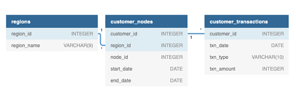

## Contents:
- [Introduction](#introduction)
- [Entity Relationship Diagram](#entity-relationship-diagram)
- [Case Study Questions](#case-study-questions)
  - [A. Data Cleansing Steps](#a-data-cleansing-steps)
  - [B. Data Exploration](#b-data-exploration)
  - [C. Before & After Analysis](#c-before--after-analysis)
  - [D. Bonus Question](#d-bonus-question)
- [Conclusion](#conclusion)

## Introduction
>Data Mart is an analytical project aimed at studying the impact of supply chain changes on sales. In June 2020, the company switched to fully sustainable packaging materials covering the entire process—from farm to customer.
>
>The project's goal is to quantify the effects of these changes and identify key factors affected by the updated supply strategy.
>
>Key research objectives:
>
>- Determine the impact of implementing sustainable packaging on sales.
>- Identify the platforms, regions, segments, and customer types most affected by the changes.
>- Develop recommendations to minimize potential negative effects during future implementations of similar initiatives.

## Entity Relationship Diagram

<details>
  <summary><em><strong>show database schema*</strong></em></summary>

```SQL
CREATE SCHEMA data_mart;
SET search_path = data_mart;


DROP TABLE IF EXISTS data_mart.weekly_sales;
CREATE TABLE data_mart.weekly_sales (
  "week_date" VARCHAR(7),
  "region" VARCHAR(13),
  "platform" VARCHAR(7),
  "segment" VARCHAR(4),
  "customer_type" VARCHAR(8),
  "transactions" INTEGER,
  "sales" INTEGER
);

INSERT INTO data_mart.weekly_sales
  ("week_date", "region", "platform", "segment", "customer_type", "transactions", "sales")
VALUES
  ('31/8/20', 'ASIA', 'Retail', 'C3', 'New', '120631', '3656163'),
  ('31/8/20', 'ASIA', 'Retail', 'F1', 'New', '31574', '996575'),
  ('31/8/20', 'USA', 'Retail', 'null', 'Guest', '529151', '16509610'),
  ('31/8/20', 'EUROPE', 'Retail', 'C1', 'New', '4517', '141942'),
  ('31/8/20', 'AFRICA', 'Retail', 'C2', 'New', '58046', '1758388'),
  ('31/8/20', 'CANADA', 'Shopify', 'F2', 'Existing', '1336', '243878'),
  ('31/8/20', 'AFRICA', 'Shopify', 'F3', 'Existing', '2514', '519502'),
  ('31/8/20', 'ASIA', 'Shopify', 'F1', 'Existing', '2158', '371417'),
  ('31/8/20', 'AFRICA', 'Shopify', 'F2', 'New', '318', '49557'),
  ('31/8/20', 'AFRICA', 'Retail', 'C3', 'New', '111032', '3888162'),
  ...
  ('26/3/18', 'SOUTH AMERICA', 'Shopify', 'F1', 'New', '3', '677'),
  ('26/3/18', 'ASIA', 'Retail', 'F3', 'New', '81842', '2673553'),
  ('26/3/18', 'CANADA', 'Shopify', 'C3', 'New', '48', '7672'),
  ('26/3/18', 'EUROPE', 'Shopify', 'F3', 'New', '2', '300'),
  ('26/3/18', 'USA', 'Retail', 'C3', 'New', '39356', '1617709'),
  ('26/3/18', 'AFRICA', 'Retail', 'C3', 'New', '98342', '3706066'),
  ('26/3/18', 'USA', 'Shopify', 'C4', 'New', '16', '2784'),
  ('26/3/18', 'USA', 'Retail', 'F2', 'New', '25665', '1064172'),
  ('26/3/18', 'EUROPE', 'Retail', 'C4', 'New', '883', '33523'),
  ('26/3/18', 'AFRICA', 'Retail', 'C3', 'Existing', '218516', '12083475');
```

**\*Note**:
1. Primary keys are not explicitly defined in the tables. This might be intentional due to the educational nature of the project:  
  - The data is artificially generated and static, minimizing the risk of integrity violations.  
  - In real-world scenarios, primary keys are essential to enforce data integrity and uniqueness.  

2. Data type inconsistencies are present in inserted values:
  - For example, the week_date column is defined as VARCHAR(7), while storing date-like values.
  - PostgreSQL implicitly converts values when necessary, but this practice is discouraged in production environments.
  - Explicit type casting should be used to ensure data consistency and prevent unexpected errors.

</details>




## Case Study Questions
### A. Data Cleansing Steps

***Task Description***
>In a single query, perform the following operations and generate a new table in the data_mart schema named clean_weekly_sales:
>
>- Convert the week_date to a DATE format
>
>- Add a week_number as the second column for each week_date value, for example any value from the 1st of January to 7th of January will be 1, 8th to 14th will be 2 etc
>
>- Add a month_number with the calendar month for each week_date value as the 3rd column
>
>- Add a calendar_year column as the 4th column containing either 2018, 2019 or 2020 values
>
>- Add a new column called age_band after the original segment column using the following mapping on the number inside the segment value
>
>| segment	| age_band    |
>|:--------|:------------|
>|1        |Young Adults |
>|2        |Middle Aged  |
>|3 or 4   | Retirees    |
>
>- Add a new demographic column using the following mapping for the first letter in the segment values:
>
>| segment | demographic |
>|:--------|:------------|
>|C        |Couples      |
>|F	      |Families     |
>
>- Ensure all null string values with an "unknown" string value in the original segment column as well as the new age_band and demographic columns
>
>- Generate a new avg_transaction column as the sales value divided by transactions rounded to 2 decimal places for each record

***Solution:***
```SQL
CREATE TABLE IF NOT EXISTS data_mart.clean_weekly_sales (
  "week_date" DATE,
  "week_number" INTEGER,
  "month_number" INTEGER,
  "calendar_year"  INTEGER,
  "segment" VARCHAR(7),
  "age_band" VARCHAR(12),
  "demographic" VARCHAR(8),
  "avg_transaction" NUMERIC(5, 2)
  );
  
INSERT INTO data_mart.clean_weekly_sales
SELECT
  week_date,
  EXTRACT('week' FROM week_date) AS week_number,
  EXTRACT('month' FROM week_date) AS month_number,
  EXTRACT('year' FROM week_date) AS calendar_year,
  segment,
  CASE
    WHEN age_band = '1' THEN 'Young Adults'
    ELSE 
      CASE
        WHEN age_band = '2' THEN 'Middle Aged'
        ELSE 
          CASE
            WHEN age_band = 'unknown' THEN age_band
            ELSE 'Retirees'
          END
      END
  END AS age_band,
  CASE
    WHEN demographic = 'unknown' THEN demographic
    ELSE
      CASE
        WHEN demographic = 'C' THEN 'Couples'
        ELSE 'Families'
      END
  END AS demographic,
  ROUND(sales / transactions, 2) AS avg_transaction 
FROM (
  SELECT
    to_date(week_date, 'DD/MM/YY') AS week_date,
    CASE
      WHEN segment = 'null' THEN 'unknown'
      ELSE segment
    END AS segment,
    CASE
      WHEN segment = 'null' THEN 'unknown'
      ELSE RIGHT(segment, 1)
    END AS age_band,
    CASE
      WHEN segment = 'null' THEN 'unknown'
      ELSE LEFT(segment, 1)
    END AS demographic,
    transactions,
    sales
  FROM
    weekly_sales
  ) sub
;

SELECT * FROM clean_weekly_sales LIMIT 10;
```

<details>
  <summary><em><strong>show description</strong></em></summary>

- Subquery `sub`:  
  - Converts `week_date` from `VARCHAR` to `DATE` using `TO_DATE()`.  
  - Replaces `'null'` values in `segment` with `'unknown'`.  
  - Extracts the last character of `segment` as `age_band`.  
  - Extracts the first character of `segment` as `demographic`.  

- Main `SELECT` Statement:  
  - Extracts `week_number`, `month_number`, and `calendar_year` using `EXTRACT()`.  
  - Maps `age_band` based on predefined categories:  
    - `'1'` → `'Young Adults'`  
    - `'2'` → `'Middle Aged'`  
    - `'3'` or `'4'` → `'Retirees'`  
    - `'unknown'` remains unchanged.  
  - Maps `demographic` values:  
    - `'C'` → `'Couples'`  
    - `'F'` → `'Families'`  
    - `'unknown'` remains unchanged.  
  - Calculates `avg_transaction` as `sales / transactions`, rounded to 2 decimal places.  

- `Final Step`:  
  - Inserts transformed data into `data_mart.clean_weekly_sales`.  
  - Ensures structured and cleaned dataset for further analysis.  

</details>

***Result table:***

| week_date  | week_number | month_number | calendar_year | segment | age_band     | demographic | avg_transaction |
| ---------- | ----------- | ------------ | ------------- | ------- | ------------ | ----------- | --------------- |
| 2020-08-31 | 36          | 8            | 2020          | C3      | Retirees     | Couples     | 30.00           |
| 2020-08-31 | 36          | 8            | 2020          | F1      | Young Adults | Families    | 31.00           |
| 2020-08-31 | 36          | 8            | 2020          | unknown | unknown      | unknown     | 31.00           |
| 2020-08-31 | 36          | 8            | 2020          | C1      | Young Adults | Couples     | 31.00           |
| 2020-08-31 | 36          | 8            | 2020          | C2      | Middle Aged  | Couples     | 30.00           |
| 2020-08-31 | 36          | 8            | 2020          | F2      | Middle Aged  | Families    | 182.00          |
| 2020-08-31 | 36          | 8            | 2020          | F3      | Retirees     | Families    | 206.00          |
| 2020-08-31 | 36          | 8            | 2020          | F1      | Young Adults | Families    | 172.00          |
| 2020-08-31 | 36          | 8            | 2020          | F2      | Middle Aged  | Families    | 155.00          |
| 2020-08-31 | 36          | 8            | 2020          | C3      | Retirees     | Couples     | 35.00           |

---

### B. Data Exploration
#### 1. What day of the week is used for each `week_date` value?

***query:***
```SQL
SELECT DISTINCT
  TO_CHAR(week_date, 'Day') AS week_day
FROM
  clean_weekly_sales;
```

<details>
  <summary><em><strong>show description:</strong></em></summary>

The SQL query retrieves the distinct day names from the `week_date` column in the `clean_weekly_sales` table.

- `TO_CHAR(week_date, 'Day')`: Converts the `week_date` values into their corresponding weekday names.
- `DISTINCT`: Ensures that only unique weekday names appear in the result.

</details>

***answer:***
| week_day |
| ---------|
| Monday   |

---

#### 2. What range of week numbers are missing from the dataset?

***query:***
```SQL
WITH week_numbers AS (
  SELECT
    *
  FROM
    generate_series(
      (SELECT MIN(week_number) FROM clean_weekly_sales),
      (SELECT MAX(week_number) FROM clean_weekly_sales)
    ) AS week_number
  )

SELECT
  wn.week_number
FROM
  week_numbers wn
LEFT JOIN 
  clean_weekly_sales cws USING (week_number)
WHERE cws.week_number IS NULL;
```

<details>
  <summary><em><strong>show description:</strong></em></summary>

The SQL query identifies week numbers that are missing from the `clean_weekly_sales` table within the range of existing week numbers.

-   `WITH week_numbers AS (...)`: Generates a series of all week numbers between the minimum and maximum week numbers found in the `clean_weekly_sales` table.
-   `generate_series( (SELECT MIN(week_number) FROM clean_weekly_sales), (SELECT MAX(week_number) FROM clean_weekly_sales) )`: Creates a sequential list of integers from the minimum to the maximum `week_number` values.
-   `LEFT JOIN clean_weekly_sales cws USING (week_number)`: Performs a left join between the generated week numbers and the `clean_weekly_sales` table, keeping all generated week numbers.
-   `WHERE cws.week_number IS NULL`: Filters the results to include only those generated week numbers that do not have a corresponding entry in the `clean_weekly_sales` table, indicating missing week numbers.

</details>

***answer:***
| week_number |
| ------------|
|             |

***\*The query returned an empty table, no week numbers are missing***

---

#### 3. How many total transactions were there for each year in the dataset?

***query:***
```SQL
SELECT
  calendar_year,
  COUNT(avg_transaction) AS transactions_amount
FROM
  clean_weekly_sales
GROUP BY
  calendar_year
ORDER BY
  calendar_year;
```

<details>
  <summary><em><strong>show description:</strong></em></summary>

The SQL query calculates the total number of transactions for each year in the `clean_weekly_sales` dataset.

-   `SELECT calendar_year, COUNT(avg_transaction) AS transactions_amount`: Selects the calendar year and counts the number of transactions, aliasing the count as `transactions_amount`.
-   `COUNT(avg_transaction)`: Counts the number of non-NULL values in the `avg_transaction` column, effectively counting the number of transactions.
-   `FROM clean_weekly_sales`: Specifies the table from which to retrieve the data.
-   `GROUP BY calendar_year`: Groups the results by calendar year, so the count is performed for each year separately.
-   `ORDER BY calendar_year`: Orders the results by calendar year in ascending order.

</details>

***answer:***
| calendar_year | transactions_amount |
| ------------- | ------------------- |
| 2018          | 5698                |
| 2019          | 5708                |
| 2020          | 5711                |

---

#### 4. What is the total sales for each region for each month?

***query:***
```SQL
WITH short_weekly_sales AS (
  SELECT
    EXTRACT('month' FROM to_date(week_date, 'DD/MM/YY')) AS month_number,
    region,
    sales
  FROM
    weekly_sales
)

SELECT
  region,
  month_number,
  SUM(sales) AS total_sales
FROM
  short_weekly_sales
GROUP BY
  region,
  month_number
ORDER BY
  region,
  month_number;
```

<details>
  <summary><em><strong>show description:</strong></em></summary>

The SQL query calculates the total sales for each region for each month, represented by its numerical value.

-   `WITH short_weekly_sales AS (...)`: Creates a common table expression (CTE) named `short_weekly_sales` to simplify the main query.
-   `EXTRACT('month' FROM to_date(week_date, 'DD/MM/YY')) AS month_number`: Extracts the month number from the `week_date` column, converting it to a date using the specified format.
-   `region, sales`: Selects the region and sales columns.
-   `SELECT region, month_number, SUM(sales) AS total_sales`: Selects the region, month number, and the sum of sales, aliasing the sum as `total_sales`.
-   `SUM(sales)`: Calculates the sum of the sales for each group.
-   `FROM short_weekly_sales`: Specifies the CTE as the data source.
-   `GROUP BY region, month_number`: Groups the results by region and month number.
-   `ORDER BY region, month_number`: Orders the results by region and month number in ascending order.

</details>

***answer:***
| region        | month_number | total_sales |
| ------------- | ------------ | ----------- |
| AFRICA        | 3            | 567767480   |
| AFRICA        | 4            | 1911783504  |
| AFRICA        | 5            | 1647244738  |
| AFRICA        | 6            | 1767559760  |
| AFRICA        | 7            | 1960219710  |
| AFRICA        | 8            | 1809596890  |
| AFRICA        | 9            | 276320987   |
| ---           | ---          | ---         |
| USA           | 3            | 225353043   |
| USA           | 4            | 759786323   |
| USA           | 5            | 655967121   |
| USA           | 6            | 703878990   |
| USA           | 7            | 760331754   |
| USA           | 8            | 712002790   |
| USA           | 9            | 110532368   |

---

#### 5. What is the total count of transactions for each platform?

***query:***
```SQL
SELECT
 platform,
 COUNT(transactions) AS transactions_amount
FROM
  weekly_sales
GROUP BY
  platform;
```

<details>
  <summary><em><strong>show description:</strong></em></summary>

The SQL query counts the number of transactions for each platform in the `weekly_sales` table.

-   `SELECT platform, COUNT(transactions) AS transactions_amount`: Selects the platform and counts the number of transactions, aliasing the count as `transactions_amount`.
-   `COUNT(transactions)`: Counts the number of non-NULL values in the `transactions` column, effectively counting the number of transactions for each platform.
-   `FROM weekly_sales`: Specifies the table from which to retrieve the data.
-   `GROUP BY platform`: Groups the results by platform, so the count is performed for each unique platform.

</details>

***answer:***
| platform | transactions_amount |
| -------- | ------------------- |
| Shopify  | 8549                |
| Retail   | 8568                |

---

#### 6. What is the percentage of sales for Retail vs Shopify for each month?

***query:***
```SQL
WITH total_month_sales AS (
  SELECT
    EXTRACT('month' FROM to_date(week_date, 'DD/MM/YY')) AS month_number,
    SUM(sales) AS total_sales
  FROM
    weekly_sales
  GROUP BY
    month_number
  ),
platform_month_sales AS (
  SELECT
    EXTRACT('month' FROM to_date(week_date, 'DD/MM/YY')) AS month_number,
    platform,
    SUM(sales) AS platform_sales
  FROM
    weekly_sales
  GROUP BY
    month_number,
    platform
)

SELECT
  pms.month_number,
  pms.platform,
  pms.platform_sales::money,
  tms.total_sales::money,
  ROUND((pms.platform_sales::numeric / tms.total_sales) * 100, 2) AS sales_percentage  
FROM
  platform_month_sales pms
JOIN
  total_month_sales tms USING(month_number)
ORDER BY
  pms.month_number,
  pms.platform
```

<details>
  <summary><em><strong>show description:</strong></em></summary>

The SQL query calculates the percentage of sales for each platform (Retail and Shopify) for each month, displaying sales values in money format.

-   `WITH total_month_sales AS (...)`: Creates a Common Table Expression (CTE) named `total_month_sales` to calculate the total sales for each month.
    -   `EXTRACT('month' FROM to_date(week_date, 'DD/MM/YY')) AS month_number`: Extracts the month number from the `week_date` column, converting it to a date using the specified format.
    -   `SUM(sales) AS total_sales`: Calculates the sum of sales for each month.
    -   `GROUP BY month_number`: Groups the results by month number.
-   `WITH platform_month_sales AS (...)`: Creates another CTE named `platform_month_sales` to calculate the total sales for each platform within each month.
    -   `EXTRACT('month' FROM to_date(week_date, 'DD/MM/YY')) AS month_number`: Extracts the month number from the `week_date` column.
    -   `platform`: Selects the platform.
    -   `SUM(sales) AS platform_sales`: Calculates the sum of sales for each platform within each month.
    -   `GROUP BY month_number, platform`: Groups the results by month number and platform.
-   `SELECT pms.month_number, pms.platform, pms.platform_sales::money, tms.total_sales::money, ROUND((pms.platform_sales::numeric / tms.total_sales) * 100, 2) AS sales_percentage`: Selects the month number, platform, platform sales (formatted as money), total month sales (formatted as money), and calculates the percentage of sales for each platform within each month.
    -   `pms.platform_sales::money` and `tms.total_sales::money`: Converts sales values to the money data type for display.
    -   `ROUND((pms.platform_sales::numeric / tms.total_sales) * 100, 2)`: Calculates the percentage of platform sales to total month sales and rounds the result to 2 decimal places.
-   `FROM platform_month_sales pms JOIN total_month_sales tms USING(month_number)`: Joins the two CTEs on the `month_number` column.
-   `ORDER BY pms.month_number, pms.platform`: Orders the results by month number and platform.

</details>

***answer:***
| month_number | platform | platform_sales    | total_sales       | sales_percentage |
| ------------ | -------- | ----------------- | ----------------- | ---------------- |
| 3            | Retail   | $2,299,188,417.00 | $2,357,168,735.00 | 97.54            |
| 3            | Shopify  | $57,980,318.00    | $2,357,168,735.00 | 2.46             |
| 4            | Retail   | $7,735,592,234.00 | $7,926,304,534.00 | 97.59            |
| 4            | Shopify  | $190,712,300.00   | $7,926,304,534.00 | 2.41             |
| 5            | Retail   | $6,585,838,223.00 | $6,768,263,125.00 | 97.30            |
| 5            | Shopify  | $182,424,902.00   | $6,768,263,125.00 | 2.70             |
| 6            | Retail   | $7,049,949,260.00 | $7,247,714,362.00 | 97.27            |
| 6            | Shopify  | $197,765,102.00   | $7,247,714,362.00 | 2.73             |
| 7            | Retail   | $7,688,091,448.00 | $7,902,330,809.00 | 97.29            |
| 7            | Shopify  | $214,239,361.00   | $7,902,330,809.00 | 2.71             |
| 8            | Retail   | $7,191,449,998.00 | $7,407,576,007.00 | 97.08            |
| 8            | Shopify  | $216,126,009.00   | $7,407,576,007.00 | 2.92             |
| 9            | Retail   | $1,104,506,857.00 | $1,134,276,655.00 | 97.38            |
| 9            | Shopify  | $29,769,798.00    | $1,134,276,655.00 | 2.62             |

---

### C. Before & After Analysis

---

### D. Bonus Question

---

## Conclusion

---