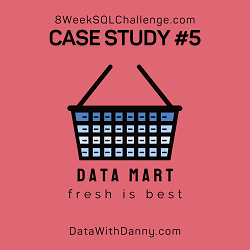

## Contents:
- [Introduction](#introduction)
- [Entity Relationship Diagram](#entity-relationship-diagram)
- [Case Study Questions](#case-study-questions)
  - [A. Data Cleansing Steps](#a-data-cleancing-steps)
  - [B. Data Exploration](#b-data-exploration)
  - [C. Before & After Analysis](#c-before--after-analysis)
  - [D. Bonus Question](#d-bonus-question)
- [Conclusion](#conclusion)

## Introduction
>Data Mart is an analytical project aimed at studying the impact of supply chain changes on sales. In June 2020, the company switched to fully sustainable packaging materials covering the entire process—from farm to customer.
>
>The project's goal is to quantify the effects of these changes and identify key factors affected by the updated supply strategy.
>
>Key research objectives:
>
>- Determine the impact of implementing sustainable packaging on sales.
>- Identify the platforms, regions, segments, and customer types most affected by the changes.
>- Develop recommendations to minimize potential negative effects during future implementations of similar initiatives.

## Entity Relationship Diagram

<details>
  <summary><em><strong>show database schema*</strong></em></summary>

```SQL
CREATE SCHEMA data_mart;
SET search_path = data_mart;


DROP TABLE IF EXISTS data_mart.weekly_sales;
CREATE TABLE data_mart.weekly_sales (
  "week_date" VARCHAR(7),
  "region" VARCHAR(13),
  "platform" VARCHAR(7),
  "segment" VARCHAR(4),
  "customer_type" VARCHAR(8),
  "transactions" INTEGER,
  "sales" INTEGER
);

INSERT INTO data_mart.weekly_sales
  ("week_date", "region", "platform", "segment", "customer_type", "transactions", "sales")
VALUES
  ('31/8/20', 'ASIA', 'Retail', 'C3', 'New', '120631', '3656163'),
  ('31/8/20', 'ASIA', 'Retail', 'F1', 'New', '31574', '996575'),
  ('31/8/20', 'USA', 'Retail', 'null', 'Guest', '529151', '16509610'),
  ('31/8/20', 'EUROPE', 'Retail', 'C1', 'New', '4517', '141942'),
  ('31/8/20', 'AFRICA', 'Retail', 'C2', 'New', '58046', '1758388'),
  ('31/8/20', 'CANADA', 'Shopify', 'F2', 'Existing', '1336', '243878'),
  ('31/8/20', 'AFRICA', 'Shopify', 'F3', 'Existing', '2514', '519502'),
  ('31/8/20', 'ASIA', 'Shopify', 'F1', 'Existing', '2158', '371417'),
  ('31/8/20', 'AFRICA', 'Shopify', 'F2', 'New', '318', '49557'),
  ('31/8/20', 'AFRICA', 'Retail', 'C3', 'New', '111032', '3888162'),
  ...
    ('26/3/18', 'SOUTH AMERICA', 'Shopify', 'F1', 'New', '3', '677'),
  ('26/3/18', 'ASIA', 'Retail', 'F3', 'New', '81842', '2673553'),
  ('26/3/18', 'CANADA', 'Shopify', 'C3', 'New', '48', '7672'),
  ('26/3/18', 'EUROPE', 'Shopify', 'F3', 'New', '2', '300'),
  ('26/3/18', 'USA', 'Retail', 'C3', 'New', '39356', '1617709'),
  ('26/3/18', 'AFRICA', 'Retail', 'C3', 'New', '98342', '3706066'),
  ('26/3/18', 'USA', 'Shopify', 'C4', 'New', '16', '2784'),
  ('26/3/18', 'USA', 'Retail', 'F2', 'New', '25665', '1064172'),
  ('26/3/18', 'EUROPE', 'Retail', 'C4', 'New', '883', '33523'),
  ('26/3/18', 'AFRICA', 'Retail', 'C3', 'Existing', '218516', '12083475');
```

**\*Note**:
1. Primary keys are not explicitly defined in the tables. This might be intentional due to the educational nature of the project:  
  - The data is artificially generated and static, minimizing the risk of integrity violations.  
  - In real-world scenarios, primary keys are essential to enforce data integrity and uniqueness.  

2. Data type inconsistencies are present in inserted values:
  - For example, the week_date column is defined as VARCHAR(7), while storing date-like values.
  - PostgreSQL implicitly converts values when necessary, but this practice is discouraged in production environments.
  - Explicit type casting should be used to ensure data consistency and prevent unexpected errors.

</details>


## Case Study Questions
### A. Data Cleansing Steps

---

### B. Data Exploration

---

### C. Before & After Analysis

---

### D. Bonus Question

---

### Conclusion

---