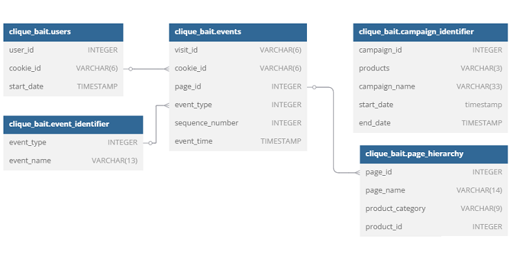

## Contents:
- [Introduction](#introduction)
- [Entity Relationship Diagram](#entity-relationship-diagram)
- [Digital Analysis](#digital-analysis)
- [Product Funnel Analysis](#product-funnel-analysis)
- [Campaigns Analysis](#campaigns-analysis)
- [Conclusion](#conclusion)

## Introduction
>Clique Bait is not like your regular online seafood store - the founder and CEO Danny, was also a part of a digital data analytics team and wanted to expand his knowledge into the seafood industry!
>
>In this case study - you are required to support Danny’s vision and analyse his dataset and come up with creative solutions to calculate funnel fallout rates for the Clique Bait online store.

## Entity Relationship Diagram

<details>
  <summary><em><strong>show database schema*</strong></em></summary>

```SQL
CREATE SCHEMA clique_bait;
SET SEARCH_PATH TO clique_bait;

CREATE TABLE event_identifier (
  "event_type" INTEGER,
  "event_name" VARCHAR(13)
);

INSERT INTO event_identifier
  ("event_type", "event_name")
VALUES
  ('1', 'Page View'),
  ('2', 'Add to Cart'),
  ('3', 'Purchase'),
  ('4', 'Ad Impression'),
  ('5', 'Ad Click');

CREATE TABLE campaign_identifier (
  "campaign_id" INTEGER,
  "products" VARCHAR(3),
  "campaign_name" VARCHAR(33),
  "start_date" TIMESTAMP,
  "end_date" TIMESTAMP
);

INSERT INTO campaign_identifier
  ("campaign_id", "products", "campaign_name", "start_date", "end_date")
VALUES
  ('1', '1-3', 'BOGOF - Fishing For Compliments', '2020-01-01', '2020-01-14'),
  ('2', '4-5', '25% Off - Living The Lux Life', '2020-01-15', '2020-01-28'),
  ('3', '6-8', 'Half Off - Treat Your Shellf(ish)', '2020-02-01', '2020-03-31');

CREATE TABLE page_hierarchy (
  "page_id" INTEGER,
  "page_name" VARCHAR(14),
  "product_category" VARCHAR(9),
  "product_id" INTEGER
);

INSERT INTO page_hierarchy
  ("page_id", "page_name", "product_category", "product_id")
VALUES
  ('1', 'Home Page', null, null),
  ('2', 'All Products', null, null),
  ('3', 'Salmon', 'Fish', '1'),
  ('4', 'Kingfish', 'Fish', '2'),
  ('5', 'Tuna', 'Fish', '3'),
  ('6', 'Russian Caviar', 'Luxury', '4'),
  ('7', 'Black Truffle', 'Luxury', '5'),
  ('8', 'Abalone', 'Shellfish', '6'),
  ('9', 'Lobster', 'Shellfish', '7'),
  ('10', 'Crab', 'Shellfish', '8'),
  ('11', 'Oyster', 'Shellfish', '9'),
  ('12', 'Checkout', null, null),
  ('13', 'Confirmation', null, null);

CREATE TABLE users (
  "user_id" INTEGER,
  "cookie_id" VARCHAR(6),
  "start_date" TIMESTAMP
);

INSERT INTO users
  ("user_id", "cookie_id", "start_date")
VALUES
  ('1', 'c4ca42', '2020-02-04'),
  ('2', 'c81e72', '2020-01-18'),
  ('3', 'eccbc8', '2020-02-21'),
  ('4', 'a87ff6', '2020-02-22'),
  ('5', 'e4da3b', '2020-02-01'),
  ...
  ('355a6a', '87a4ba', '8', '2', '12', '2020-03-18 22:42:33.090104'),
  ('355a6a', '87a4ba', '9', '1', '13', '2020-03-18 22:42:59.762131'),
  ('355a6a', '87a4ba', '9', '2', '14', '2020-03-18 22:43:57.15588'),
  ('355a6a', '87a4ba', '10', '1', '15', '2020-03-18 22:44:16.541396'),
  ('355a6a', '87a4ba', '11', '1', '16', '2020-03-18 22:44:18.90083'),
  ('355a6a', '87a4ba', '11', '2', '17', '2020-03-18 22:45:12.670472'),
  ('355a6a', '87a4ba', '12', '1', '18', '2020-03-18 22:45:54.081818'),
  ('355a6a', '87a4ba', '13', '3', '19', '2020-03-18 22:45:54.984666');
```

**\*Note**:
1.  **Primary Key Absence:**
    * Primary keys are intentionally omitted for this educational dataset.
    * This is acceptable due to the static and artificially generated nature of the data.
    * **In production, primary keys are crucial for data integrity and uniqueness.**

2.  **Data Type Inconsistencies:**
    * Inserted values may not match column data types (e.g., string values in INTEGER columns).
    * While PostgreSQL performs implicit conversions, **explicit type casting is recommended for production to ensure data consistency and prevent errors.**

</details>



## Case Study Questions
### Digital Analysis
#### 1. How many users are there?

***query:***
```SQL
SELECT
  COUNT(DISTINCT user_id) AS unique_users
FROM
  users;
```

<details>
  <summary><em><strong>show description:</strong></em></summary>

This SQL query calculates the total number of unique user IDs present in the `users` table.

-   `SELECT COUNT(DISTINCT user_id) AS unique_users`: 
    -   `DISTINCT user_id`: Selects all the unique values from the `user_id` column, eliminating any duplicate user IDs.
    -   `COUNT(...)`: Counts the number of distinct (unique) user IDs.
    -   `AS unique_users`: Renames the resulting count to the column alias `unique_users`.
-   `FROM users`:
    -   Specifies that the data is retrieved from the `users` table.

</details>

***result table:***

| unique_users |
| ------------ |
| 500          |

---

#### 2. How many cookies does each user have on average?

***query:***
```SQL
SELECT
  ROUND(AVG(cookies_amount)) AS average_cookies_amount
FROM (
  SELECT
    user_id,
    COUNT(DISTINCT cookie_id) AS cookies_amount
  FROM
    users
  GROUP BY  user_id) sub;
```

<details>
  <summary><em><strong>show description:</strong></em></summary>

This SQL query calculates the average number of unique cookies per user from the `users` table.

-   `SELECT ROUND(AVG(cookie_count) AS average_cookies_per_user`:
    -   Calculates the average number of cookies per user, rounding the result to the nearest integer.
    -   `AVG(cookie_count)`: Computes the average of the `cookie_count` values.
    -   `ROUND(..., 2)`: Rounds the average to two decimal places for readability.
    -   `AS average_cookies_per_user`: Aliases the resulting column as `average_cookies_per_user`.
-   `FROM (...) sub`:
    -   Specifies the subquery as the data source.
-   Subquery:
    -   `SELECT user_id, COUNT(DISTINCT cookie_id) AS cookie_count FROM users GROUP BY user_id`:
        -   Calculates the number of unique cookies (`cookie_id`) for each user (`user_id`).
        -   `COUNT(DISTINCT cookie_id)`: Counts the distinct cookies for each user.
        -   `GROUP BY user_id`: Groups the results by `user_id` to count cookies per user.
        -   `AS cookie_count`: Aliases the count of cookies as `cookie_count`.
        -   `FROM users`: Specifies that the data is retrieved from the `users` table.

</details>

***result table:***

| averege_cookies_amount |
| ---------------------- |
| 4                      |

---

#### 3. What is the unique number of visits by all users per month?

***query:***
```SQL
SELECT
  EXTRACT(YEAR FROM event_time) AS year,
  TO_CHAR(event_time, 'Month') AS month,
  COUNT(DISTINCT visit_id) AS unique_visits
FROM
  events
GROUP BY
  year,
  month
ORDER BY
  unique_visits DESC;
```

<details>
  <summary><em><strong>show description:</strong></em></summary>

This SQL query calculates the unique number of visits (identified by `visit_id`) per month and year from the `events` table.

-   `SELECT EXTRACT(YEAR FROM event_time) AS year, TO_CHAR(event_time, 'Month') AS month, COUNT(DISTINCT visit_id) AS unique_visits`:
    -   `EXTRACT(YEAR FROM event_time) AS year`: Extracts the year from the `event_time` column and aliases it as `year`.
    -   `TO_CHAR(event_time, 'Month') AS month`: Extracts the month from the `event_time` column and aliases it as `month`.
    -   `COUNT(DISTINCT visit_id) AS unique_visits`: Counts the number of unique `visit_id` values, representing unique visits, and aliases the result as `unique_visits`.
-   `FROM events`:
    -   Specifies the `events` table as the data source.
-   `GROUP BY year, month`:
    -   Groups the results by `year` and `month` to count unique visits per month and year.
-   `ORDER BY unique_visits DESC`:
    -   Orders the results in descending order based on the `unique_visits` count.

</details>

***result table:***

| year | month     | unique_visits |
| ---- | --------- | ------------- |
| 2020 | February  | 1488          |
| 2020 | March     | 916           |
| 2020 | January   | 876           |
| 2020 | April     | 248           |
| 2020 | May       | 36            |

---

#### 4. What is the number of events for each event type?

***query:***
```SQL

```

<details>
  <summary><em><strong>show description:</strong></em></summary>


</details>

***result table:***


---

#### 5. What is the percentage of visits which have a purchase event?

***query:***
```SQL

```

<details>
  <summary><em><strong>show description:</strong></em></summary>


</details>

***result table:***


---

#### 6. What is the percentage of visits which view the checkout page but do not have a purchase event?

***query:***
```SQL

```

<details>
  <summary><em><strong>show description:</strong></em></summary>


</details>

***result table:***


---

#### 7. What are the top 3 pages by number of views?

***query:***
```SQL

```

<details>
  <summary><em><strong>show description:</strong></em></summary>


</details>

***result table:***


---

#### 8. What is the number of views and cart adds for each product category?

***query:***
```SQL

```

<details>
  <summary><em><strong>show description:</strong></em></summary>


</details>

***result table:***


---

#### 9. What are the top 3 products by purchases?

***query:***
```SQL

```

<details>
  <summary><em><strong>show description:</strong></em></summary>


</details>

***result table:***


---